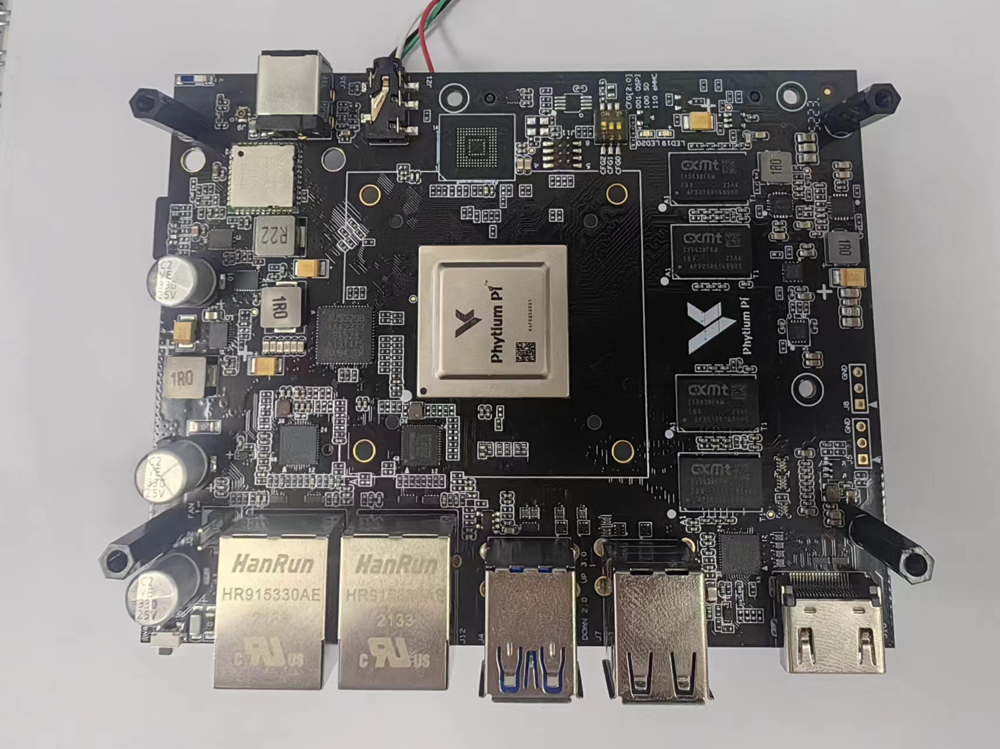
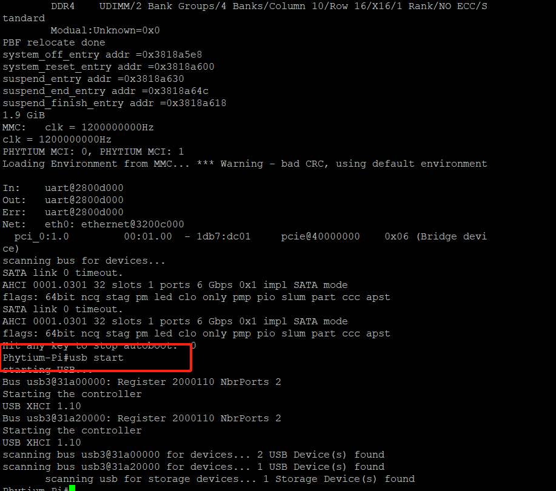
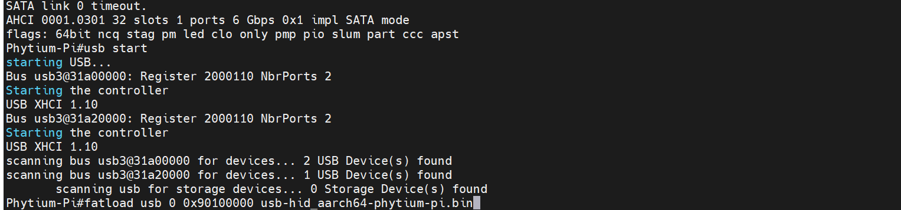

# 飞腾派运行ArceOS

1. 硬件准备：
   * 飞腾派板子
   
     
   
   * 两张SD卡，一张放BootLoader和dtb(或者可以直接烧录官方系统镜像)，一张放ArceOS启动镜像

     * Bootloader位置：<https://gitee.com/phytium_embedded/phytium-pi-os/tree/master/package/phyuboot/src>

     * dtb位置：<https://gitee.com/phytium_embedded/phytium-linux-kernel/blob/linux-5.10/arch/arm64/boot/dts/phytium/phytiumpi_firefly.dts>
   
   * 读卡器
   
   * USB转TTL串口线
   
   * ArceOS代码地址：<https://github.com/arceos-usb/arceos_experiment/tree/phytium_pi_port>（注意分支）
  
     `git clone -b phytium_pi_port git@github.com:arceos-usb/arceos_experiment.git`
     
     编译镜像命令：`make A=apps/cli PLATFORM=aarch64-phytium-pi LOG=debug`

     生成的bin文件在apps/cli目录下

   
2. 飞腾派上电启动，把有ArceOS启动镜像的读卡器或者U盘插到飞腾派上，用串口把飞腾派与电脑相连接，启动电脑上的远程连接软件，如Putty，波特率设置为115200

   串口接法：接8、10、12号引脚位置，如图所示（8号代表TX，接RX；10号代表RX，接TX；12号接地线）

   

3. 在uboot倒计时结束前按任意键进入手动引导
   * 输入`usb start` ,启用USB驱动来识别插入的USB设备（读卡器/U盘）
   
     
   
   * 输入`fatload usb 0 0x90100000 cli_aarch64-phytium-pi.bin`，从插入的USB设备上下载ArceOS镜像
   
     
   
   * 输入`go 0x90100000`加载ArceOS镜像
   
     
   
     （这里是没有开debug）
   
   * 便可以看到ArceOS启动成功，进入到了shell界面
   
     
