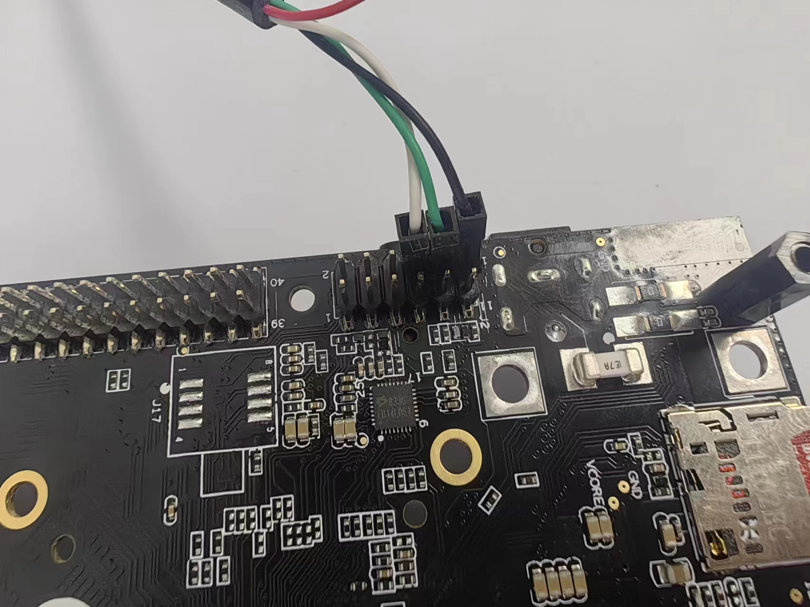
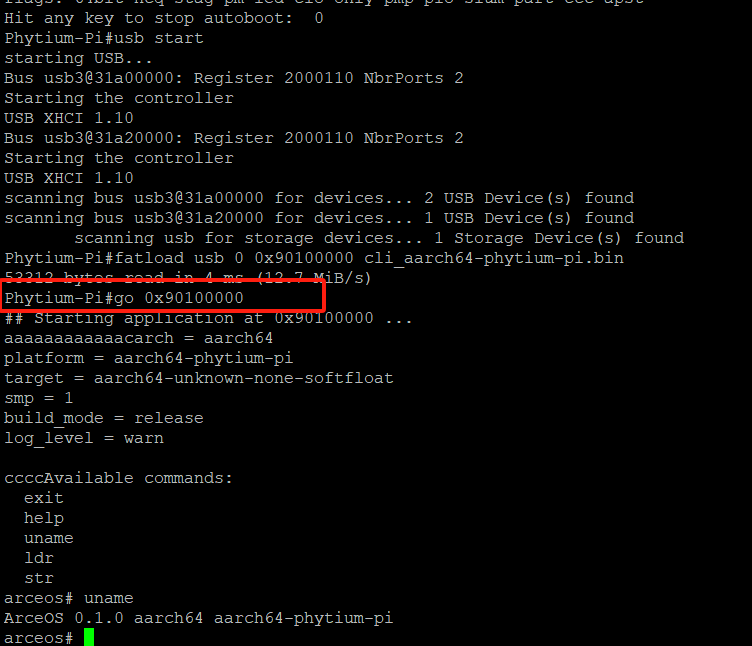

# 飞腾派运行ArceOS

1. 硬件准备：
   * 飞腾派板子
   
     
   
   * 两张SD卡，一张放BootLoader和dtb(或者可以直接烧录官方系统镜像)，一张放ArceOS启动镜像

     * Bootloader位置：<https://gitee.com/phytium_embedded/phytium-pi-os/tree/master/package/phyuboot/src>

     * dtb位置：<https://gitee.com/phytium_embedded/phytium-linux-kernel/blob/linux-5.10/arch/arm64/boot/dts/phytium/phytiumpi_firefly.dts>
   
   * 读卡器
   
   * USB转TTL串口线
   
   * ArceOS代码地址：<https://github.com/arceos-usb/arceos_experiment/tree/phytium_pi_dev>（注意分支）
  
     `git clone -b phytium_pi_dev git@github.com:arceos-usb/arceos_experiment.git`
     
     编译镜像命令：`make A=apps/usb PLATFORM=aarch64-phytium-pi LOG=debug`

     生成的bin文件在apps/cli目录下

   
2. 飞腾派上电启动，把有ArceOS启动镜像的读卡器或者U盘插到飞腾派上，用串口把飞腾派与电脑相连接，启动电脑上的远程连接软件，如Putty，波特率设置为115200

   串口接法：接8、10、12号引脚位置，如图所示（8号代表TX，接RX；10号代表RX，接TX；12号接地线）

   

3. 在uboot倒计时结束前按任意键进入手动引导
   * 输入`usb start` ,启用USB驱动来识别插入的USB设备（读卡器/U盘）
   
     ![]https://github.com/chenlongos/raspi4-with-arceos-doc/blob/master/src/assert/%E9%A3%9E%E8%85%BE%E6%B4%BE%E5%90%AF%E5%8A%A8ArceOS-1.png)
   
   * 输入`fatload usb 0 0x90100000 usb_aarch64-phytium-pi.bin`，从插入的USB设备上下载ArceOS镜像
   
     
   
   * 输入`go 0x90100000`加载ArceOS镜像
   
     
   
     （这里是没有添加LOG=debug）
   
   * 便可以看到ArceOS启动成功，进入到了shell界面
   
     

更直观方便的实验方法，在linux终端里面测试USB返回的debug信息

Usbipd是一种将USB设备连接到WSL上面的工具，可以将串口返回的信息映射到WSL终端里面，方便实验
下载流程如下：
打开powershell，输入winget search usbipd，找到usbipd工具之后，输入winget install usbipd下载usbipd。
下载完成之后
输入usbipd list，查看主机上连接好的串口ID号，
输入sudo usbipd bind -b 2-2，实现串口全设备共享，
输入usbipd attach --wsl -b 2-2，实现串口返回信息映射到wsl终端
（2-2是串口ID号，具体依据个人电脑上显示的串口ID号）

这里需要注意的是，主机上只能留下一个linux终端，不然串口返回的信息不清楚该映射到哪一个终端界面

打开linux终端，输入sudo chmod 777 /dev/ttyUSB0，赋予串口映射到wsl上的权限，
（ttyUSB0通常表示接到计算机的第一个串行设备，在个人主机上具体是多少，可以通过输入 ls -l /dev 来查看）

然后请你下载python3，同时下载xmodem，pyserial
方便加载脚本的py文件的运行

在项目根目录下输入：
make A=apps/usb PLATFORM=aarch64-phytium-pi LOG=debug chainboot
前面的make是将整个arceos内核与USB驱动给编译好，
后面的chainboot用来执行一个arceos_experiment目录中的一个脚本文件，
将编译好的内核文件通过SD卡中的Uboot加载到飞腾派上

在看到tools/….出来之后，给飞腾派上电，同时确保鼠标已经插到了飞腾派上
等待uboot加载完之后，看到Phytium-Pi#出现，
输入go 0x90100000，arceos内核开始运行，接着usb驱动的debug信息
