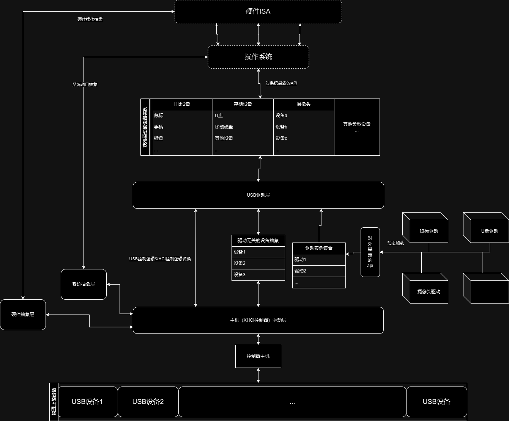
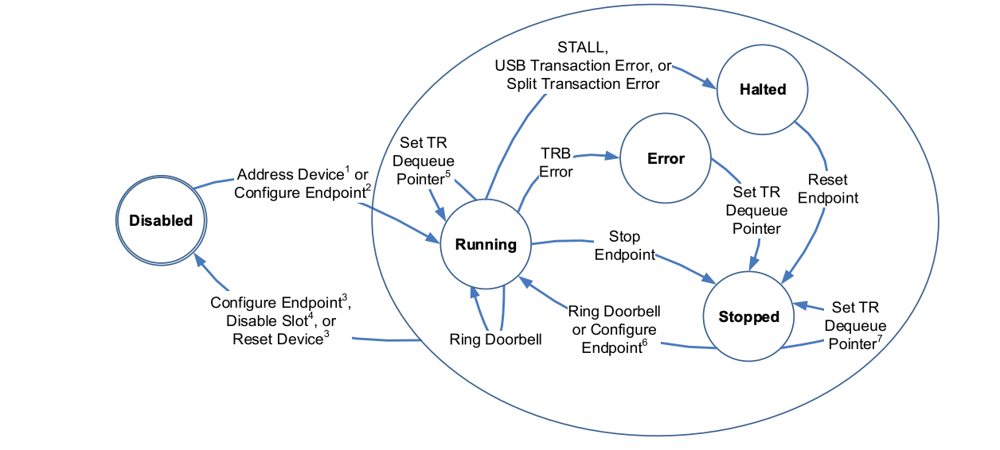
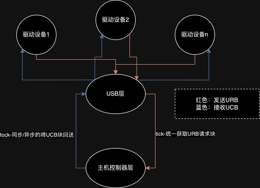

# USB驱动代码导读

[TOC]

## 前言-系统架构



在这张图中，我们可以看到这些要点：

* 主机驱动层：usb系统发展至今，已经到了第四代了，目前市面上大多数usb主机控制器都是usb3.0主机控制器-xhci(eXtensible Host Controller Interface)，由于其可扩展性，因此usb4也在使用它，在可预见的将来，xhci还会存在相当长一段时间，但这并不意味着我们就可以忽略过去的几种主机控制器-ehci/ohci/uhci，甚至是在虚拟化的环境下-vhci，因此，对于不同的主机，抽象出一套统一的接口上有必要的。

* 驱动无关的设备抽象：usb协议的上层建筑，各种驱动千变万化，但是它们都有着共同的操作对象，因此我们在这里将所有驱动都会用到的设备数据抽象出来，进一步的说，其内包含：
  
  * 设备的描述符
    
    * 设备的描述符通过控制传输从设备获取，由厂家定义，描述符为树形结构，其拓扑一般如下：
      
      　　
  
  * 设备当前所使用的interface与config值与端点的概念
    
    * config-设备的配置-对应着上图中的配置描述符，有一个设备一次只能选择一个配置
    
    * interface-设备的功能，举个例子，无线鼠标接收器，在主机看来，其实往往是一个复合设备——他同时有鼠标/键盘/手柄的功能，每个功能都对应着一个接口描述符
    
    * endpoint-设备端点-对应着图中的端点描述符，“端点”在usb系统中，是主机与设备沟通的最小通道，端点本身也是一种状态机
      
      
      
      在初始状态下，除了永远保持开启的0号端点（控制端点），其余端点都处于未被配置的Disabled状态，当一个配置被选择时，主机需要根据这个配置下的所有端点描述符对对应的端点做初始化（确定端点的传输方式，传输间隔，传输大小等）。
  
  * 设备的slot id-当设备被插入时，主机就会为设备分配一个唯一的slot id，这么做的原因是物理接口往往是可扩展的，因此用物理接口号来识别设备会造成混淆

* USB驱动层：这一层则是对USB协议的封装，与主机控制器的内容并不相关，就像是其他的常见usb主机侧驱动一样（比如：linux，windows，circle os，redox...)它们都有一种叫做URB(USB Request Block)的结构体，其内记录了发起一次usb请求所需要的全部信息，这些信息在主机驱动层被解析为不同的主机控制器所对应的特定操作。而在我们的usb系统中，我们也设计了类似的结构：
  
  * URB:我们的系统中也具有URB的概念，但与其他的系统略有不同
    
    * 模版匹配：得益于rust强大的模版匹配机制，我们并不需要像其他系统一样设计一个庞大的结构体:
      
      ```rust
      //...
      #[derive(Clone)]
      pub struct URB<'a, O>
      where
          O: PlatformAbstractions,
      {
          pub device_slot_id: usize,
          pub operation: RequestedOperation<'a>,
          pub sender: Option<Arc<SpinNoIrq<dyn USBSystemDriverModuleInstance<'a, O>>>>,
      }
      //...
      #[derive(Debug, Clone)]
      pub enum RequestedOperation<'a> {
          Control(ControlTransfer),
          Bulk,
          Interrupt(InterruptTransfer),
          Isoch,
          ConfigureDevice(Configuration<'a>),
      }
      
      #[derive(Debug, Clone)]
      pub struct ControlTransfer {
          pub request_type: bmRequestType,
          pub request: bRequest,
          pub index: u16,
          pub value: u16,
          pub data: Option<(usize, usize)>,
      }
      //...
      ```
      
      ```
      * 注意到RequestOperation这个枚举类型，其对应了usb的四种传输(控制，中断，块，同步)以及一种额外的请求：设备配置（如，为设备分配地址，硬重置设备端口等），在实际使用中，这种模式这给予了我们不同往日的灵活。
      ```
    
    * UCB：这个结构体包含了URB所发起的事件的完成信息（完成状态，是否有错误，回报信息），与urb形成了对称，当URB的时间完成时，UCB将会被创建，并通过URB中的“sender”字段所保存的请求发起者的引用，回报给请求发起者（即被驱动创建的设备实例）

* 驱动api：可以在图中看到，我们的驱动部分是可扩展的，甚至可以动态的加载驱动模块，有着非常巧妙的设计：
  
  * 首先，我们的驱动采用部分工厂模式+状态机的思想，其api定义如下：
    
    ```rust
    pub trait USBSystemDriverModule<'a, O>: Send + Sync
    where
        O: PlatformAbstractions,
    {
        fn should_active(
            &self,
            independent_dev: &DriverIndependentDeviceInstance<O>,
            config: Arc<SpinNoIrq<USBSystemConfig<O>>>,
        ) -> Option<Vec<Arc<SpinNoIrq<dyn USBSystemDriverModuleInstance<'a, O>>>>>;
    
        fn preload_module(&self);
    }
    
    pub trait USBSystemDriverModuleInstance<'a, O>: Send + Sync
    where
        O: PlatformAbstractions,
    {
        fn prepare_for_drive(&mut self) -> Option<Vec<URB<'a, O>>>;
    
        fn gather_urb(&mut self) -> Option<URB<'a, O>>;
    
        fn receive_complete_event(&mut self, event: event::Allowed);
    }
    ```
    
    * USBSystemDriverModule：这是创建“驱动设备”的工厂，当有新设备被初始化完成时，usb层就会对每个驱动模块进行查询，当确定到有合适的驱动模块时，就会使对应的模块创建一个“驱动设备”的实例
    
    * USBSystemDriverModuleInstance：即上文所提到的“驱动设备”，该设备与下层的“驱动无关设备”并不耦合，具体的来说，驱动设备应当被设计为一种状态机，usb系统在开始运行后，就会在每个loop的通过轮询所有“驱动设备”的`gather_urb`方法收集URB请求（根据驱动设备的状态，可能得到不同的，甚至干脆就没有URB,这些都是根据驱动设备的当前状态及其内部实现来决定的，我们称为-tick），在获取到了一大堆的URB后，就会将他们统一提交给主机控制器层，并等待任务完成后将UCB提交回驱动设备以改变驱动设备的状态（我们称为-tock）
    
    * 也就是说，在正常运行的前提下，我们整个usb系统都是在不断的进行"tick-tock"，就像是时间轮一样：
      
      

## 代码结构

```log
.
├── abstractions
│   ├── dma.rs
│   └── mod.rs
├── err.rs
├── glue
│   ├── driver_independent_device_instance.rs
│   ├── glue_usb_host.rs
│   └── mod.rs
├── host
│   ├── data_structures
│   │   ├── host_controllers
│   │   │   ├── mod.rs
│   │   │   └── xhci
│   │   │       ├── context.rs
│   │   │       ├── event_ring.rs
│   │   │       ├── mod.rs
│   │   │       └── ring.rs
│   │   └── mod.rs
│   └── mod.rs
├── lib.rs
└── usb
    ├── descriptors
    │   ├── desc_configuration.rs
    │   ├── desc_device.rs
    │   ├── desc_endpoint.rs
    │   ├── desc_hid.rs
    │   ├── desc_interface.rs
    │   ├── desc_str.rs
    │   └── mod.rs
    ├── drivers
    │   ├── driverapi.rs
    │   └── mod.rs
    ├── mod.rs
    ├── operation
    │   └── mod.rs
    ├── trasnfer
    │   ├── control.rs
    │   ├── endpoints
    │   │   └── mod.rs
    │   ├── interrupt.rs
    │   └── mod.rs
    ├── universal_drivers
    │   ├── hid_drivers
    │   │   ├── hid_mouse.rs
    │   │   └── mod.rs
    │   └── mod.rs
    └── urb.rs
```

## 用驱动案例来解读：usb-hid鼠标驱动

让我们从一个usb-hid鼠标的实现开始,追踪他发出的单个URB的的生命周期，深入的看看代码到底是怎么样运行的

[文件位置](https://github.com/arceos-usb/arceos_experiment/tree/usb-camera-base/crates/driver_usb/src/usb/universal_drivers/hid_drivers/hid_mouse.rs)

```rust
//...

pub enum ReportDescState<O> //当前获取到的设备报告描述符，为了日后要编写的HID报文解析器的方便起见，我们在这里使用枚举类封装一次
where
    O: PlatformAbstractions,
{
    Binary(SpinNoIrq<DMA<u8, O::DMA>>),
    Decoded(/*...待实现报文描述符解析器...*/),
}


//在以下的结构体中，我们需要注意的字段有这么几个
pub struct HidMouseDriver<O> //Hid鼠标-驱动设备实例-结构体
where
    O: PlatformAbstractions,
{
    config: Arc<SpinNoIrq<USBSystemConfig<O>>>,

    bootable: usize,
//bootable:hid协议特有的，bootable类型的设备会在bios中返回更丰富的数据
    device_slot_id: usize, 
//这个字段从逻辑上将当前的“驱动设备”绑定到下层的“驱动无关设备”
    interrupt_in_channels: Vec<u32>, 
//中断输入端点集合，这部分由协议与设备的描述符共同决定，因此放在这里
    interrupt_out_channels: Vec<u32>,
//中断输出端点集合，这部分由协议与设备的描述符共同决定，因此放在这里
    interface_value: usize, //interface配置值
    interface_alternative_value: usize,//interface-子配置配置值
    config_value: usize,//设备配置配置值
//以上三个配置值理论上应该是有Arc作为指针索引到驱动无关设备的相应字段，
//但这么做开销略大，因此在本地保存一份复制
    report_descriptor: Option<ReportDescState<O>>, 
/*
设备报告描述符-初始为None，
当获取到二进制值后转换为Some(ReportDescState::Binary(buffer))，
经过解析应当后转换为Some(ReportDescState::Decoded(descriptor))
*/
    driver_state_machine: HidMouseStateMachine,
/*
这个驱动的重要组成部分-甚至可以说是核心：一个状态机
一共有两种状态：待发送和等待
*/
    receiption_buffer: Option<SpinNoIrq<DMA<[u8], O::DMA>>>,
/*
数据缓冲区，见下文
*/
}

pub enum HidMouseStateMachine { //状态机从代码上实现为枚举类型
    Waiting, //等待状态
    Sending,//待发送
}

impl<'a, O> HidMouseDriver<O>
where
    O: PlatformAbstractions + 'static,
{
    fn new_and_init( //驱动设备通过这个方法创建出来
        device_slot_id: usize,
        bootable: u8,
        endpoints: Vec<Endpoint>,
        config: Arc<SpinNoIrq<USBSystemConfig<O>>>,
        interface_value: usize,
        alternative_val: usize,
        config_value: usize,
    ) -> Arc<SpinNoIrq<dyn USBSystemDriverModuleInstance<'a, O>>> {
        Arc::new(SpinNoIrq::new(Self {
            device_slot_id,
            interrupt_in_channels: {
                endpoints
                    .iter()
                    .filter_map(|ep| match ep.endpoint_type() {
                        EndpointType::InterruptIn => Some(ep.doorbell_value_aka_dci()),
                        _ => None,
                    })
                    .collect()
            },
            interrupt_out_channels: {
                endpoints
                    .iter()
                    .filter_map(|ep| match ep.endpoint_type() {
                        EndpointType::InterruptOut => Some(ep.doorbell_value_aka_dci()),
                        _ => None,
                    })
                    .collect()
            },
            config,
            interface_value,
            config_value,
            interface_alternative_value: alternative_val,
            bootable: bootable as usize,
            report_descriptor: None,
            driver_state_machine: HidMouseStateMachine::Sending,
            receiption_buffer: None,
        }))
    }
}

/*
为所有的 HidMouseDriver实现USBSystemDriverModuleInstance这个trait

以防读者不熟悉rust，特意说下，这里是rust的特殊之处，在rust中，并不存在面向对象
相反的，我们更倾向于面向数据：数据从何而来？到哪里去？
这种思想落实到这里，就是指trait-一种比接口更灵活的"行为模板"，当一个结构体实现了某种trait
就意味着这个结构体实现了这种trait的所有特性。
在这里，USBSystemDriverModuleInstance-就是驱动设备应当有的行为的封装trait，其内包含三个方法：
gather_urb：在每次tick时，usb系统从这里收集各个驱动设备所提交的urb
receive_complete_event：在每次tock时，将urb的执行结果回传给这个方法，以改变状态机
prepare_for_drive：不同的驱动意味着不同的协议，不同的协议往往有着各自自定义的初始化操作
这个方法就是为了在正常工作前，进行不同协议所定义的设备初始化
*/
impl<'a, O> USBSystemDriverModuleInstance<'a, O> for HidMouseDriver<O> 
where
    O: PlatformAbstractions,
{
    fn gather_urb(&mut self) -> Option<Vec<crate::usb::urb::URB<'a, O>>> {
        match self.driver_state_machine {
            HidMouseStateMachine::Waiting => None, 
//如果当前的状态机为等待状态，那就不发出URB
            HidMouseStateMachine::Sending => {
//如果当前的状态机为待发送状态，那么...
                self.driver_state_machine = HidMouseStateMachine::Waiting;
//发送了URB后会转换为等待状态                
                match &self.receiption_buffer {
                    Some(buffer) => buffer.lock().fill_with(|| 0u8),
                    None => {
                        self.receiption_buffer = Some(SpinNoIrq::new(DMA::new_vec(
                            0u8,
                            8,
                            O::PAGE_SIZE,
                            self.config.lock().os.dma_alloc(),
                        )))
                    }
                }
//如果数据交换buffer还没被创建，就创建一个，并将buffer清零

                if let Some(buffer) = &mut self.receiption_buffer {
                    trace!("some!");
                    return Some(vec![URB::<O>::new(
                        self.device_slot_id,
                        RequestedOperation::Interrupt(InterruptTransfer {
                            endpoint_id: self.interrupt_in_channels.last().unwrap().clone()
                                as usize,
                            buffer_addr_len: buffer.lock().addr_len_tuple(),
                        }),
                    )]);
//发送一次URB，这个URB包含一次中断传输请求，以及发起请求所需要的所有参数
                }
                None
            }
        }
    }

    fn receive_complete_event(&mut self, ucb: UCB<O>) {
//当收到UCB时
        match ucb.code {
            crate::glue::ucb::CompleteCode::Event(TransferEventCompleteCode::Success) => {
//如果收到的UCB表面传输完成
                trace!("completed!");
                self.receiption_buffer
                    .as_ref()
                    .map(|a| a.lock().to_vec().clone())
                    .inspect(|a| {
                        trace!("current buffer:{:?}", a);
//那就说明buffer里已经被填充了回报回来的数据，取出并打印
                    });
                self.driver_state_machine = HidMouseStateMachine::Sending
//并且将当前状态变回待发送，以待下次tick时继续发送中断传输请求
            }
            other => panic!("received {:?}", other),
//如果收到的UCB表明出现了错误，那么我们就让系统直接panic
//这部分的处理看似过于粗暴，但实际上是合理的——经过初始化阶段的过滤，驱动必然找到了合适的设备
//也就是说这个驱动设备必定能正常工作，如果没有，那就说明是硬件的问题
//在这种情况下，软件无法做更多事，只能panic以发出警告
        }
    }

    fn prepare_for_drive(&mut self) -> Option<Vec<URB<'a, O>>> {
//一些hid所规定的特定操作，我们仅挑几处关键的位置讲解
        trace!("hid mouse preparing for drive!");
        let endpoint_in = self.interrupt_in_channels.last().unwrap();
        let mut todo_list = Vec::new();
        todo_list.push(URB::new(
            self.device_slot_id,
            RequestedOperation::Control(ControlTransfer {
                request_type: bmRequestType::new(
                    Direction::Out,
                    DataTransferType::Standard,
                    Recipient::Device,
                ),
                request: bRequest::SetConfiguration, //设置设备的配置
                index: self.interface_value as u16,
                value: self.config_value as u16,
                data: None,
            }),
        ));
        todo_list.push(URB::new(
            self.device_slot_id,
            RequestedOperation::Control(ControlTransfer {
                request_type: bmRequestType::new(
                    Direction::Out,
                    DataTransferType::Standard,
                    Recipient::Interface,
                ),
                request: bRequest::SetInterfaceSpec, //设置设备的接口
                index: self.interface_alternative_value as u16,
                value: self.interface_value as u16,
                data: None,
            }),
        ));

        if self.bootable > 0 {
            todo_list.push(URB::new(
                self.device_slot_id,
                RequestedOperation::Control(ControlTransfer {
                    request_type: bmRequestType::new(
                        Direction::Out,
                        DataTransferType::Class,
                        Recipient::Interface,
                    ),
                    request: bRequest::SetInterfaceSpec, //设置设备的协议-即关闭设备的boot模式
                    index: if self.bootable == 2 { 1 } else { 0 },
                    value: self.interface_value as u16,
                    data: None,
                }),
            ));
        }

        self.report_descriptor = Some(ReportDescState::<O>::Binary(SpinNoIrq::new(DMA::new(
            0u8,
            O::PAGE_SIZE,
            self.config.lock().os.dma_alloc(),
        )))); //初始化报文描述符的buffer-用于接收设备回报回来的描述信息

        if let Some(ReportDescState::Binary(buf)) = &self.report_descriptor {
            todo_list.push(URB::new(
                self.device_slot_id,
                RequestedOperation::Control(ControlTransfer {
                    request_type: bmRequestType::new(
                        Direction::In,
                        DataTransferType::Standard,
                        Recipient::Interface,
                    ),
                    request: bRequest::GetDescriptor,
//获取设备的报文描述符
                    index: self.interface_alternative_value as u16,
                    value: DescriptorType::HIDReport.forLowBit(0).bits(),
                    data: Some({ buf.lock().addr_len_tuple() }),
//这里实际上产生了一个元组：(buffer地址，buffer长度)
                }),
            ));
        }

        self.interrupt_in_channels
            .iter()
            .chain(self.interrupt_out_channels.iter())
            .for_each(|dci| {
                todo_list.push(URB::new(
                    self.device_slot_id,
                    RequestedOperation::ExtraStep(ExtraStep::PrepareForTransfer(*dci as _)),
//通知主机准备进行传输，让主机层进行属于主机层的特定初始化操作
//这里仅仅是发出了通知，并无数据传输，工作的主体在主机层
                ));
            });

        Some(todo_list)
    }
}

pub struct HidMouseDriverModule; //驱动模块
//驱动模块和驱动设备有什么关系？当然是驱动模块会产生驱动设备

impl<'a, O> USBSystemDriverModule<'a, O> for HidMouseDriverModule
where
    O: PlatformAbstractions + 'static,
{
    fn should_active( 
//这个函数非常庞大，但其实质是在根据设备的描述符决定要不要启用当前模块
        &self,
        independent_dev: &DriverIndependentDeviceInstance<O>,
        config: Arc<SpinNoIrq<USBSystemConfig<O>>>,
    ) -> Option<Vec<Arc<SpinNoIrq<dyn USBSystemDriverModuleInstance<'a, O>>>>> {
        if let MightBeInited::Inited(inited) = &independent_dev.descriptors {
            let device = inited.device.first().unwrap();
            return match (
                USBDeviceClassCode::from_u8(device.data.class),
                USBHidDeviceSubClassCode::from_u8(device.data.subclass),
                device.data.protocol,
            ) {
                (
                    Some(USBDeviceClassCode::HID),
                    Some(USBHidDeviceSubClassCode::Mouse),
                    bootable,
                ) => {
                    return Some(vec![HidMouseDriver::new_and_init(
                        independent_dev.slotid,
                        bootable,
                        {
                            device
                                .child
                                .iter()
                                .find(|c| {
                                    c.data.config_val() == independent_dev.configuration_val as u8
                                })
                                .expect("configuration not found")
                                .child
                                .iter()
                                .filter_map(|func| match func {
                                    TopologicalUSBDescriptorFunction::InterfaceAssociation(_) => {
                                        panic!("a super complex device, help meeeeeeeee!");
                                    }
                                    TopologicalUSBDescriptorFunction::Interface(interface) => Some(
                                        interface
                                            .iter()
                                            .find(|(interface, alternatives, endpoints)| {
                                                interface.interface_number
                                                    == independent_dev.interface_val as u8
                                                    && interface.alternate_setting
                                                        == independent_dev
                                                            .current_alternative_interface_value
                                                            as u8
                                            })
                                            .expect("invalid interface value or alternative value")
                                            .2
                                            .clone(),
                                    ),
                                })
                                .take(1)
                                .flat_map(|a| a)
                                .collect()
                        },
                        config.clone(),
                        independent_dev.interface_val,
                        independent_dev.current_alternative_interface_value,
                        independent_dev.configuration_val,
                    )]);
                }
                (Some(USBDeviceClassCode::ReferInterfaceDescriptor), _, _) => Some({
                    let collect = device
                        .child
                        .iter()
                        .find(|configuration| {
                            configuration.data.config_val()
                                == independent_dev.configuration_val as u8
                        })
                        .expect("configuration not found")
                        .child
                        .iter()
                        .filter_map(|interface| match interface {
                            TopologicalUSBDescriptorFunction::InterfaceAssociation((
                                asso,
                                interfaces,
                            )) if let (
                                USBDeviceClassCode::HID,
                                USBHidDeviceSubClassCode::Mouse,
                                bootable,
                            ) = (
                                USBDeviceClassCode::from_u8(asso.function_class).unwrap(),
                                USBHidDeviceSubClassCode::from_u8(asso.function_subclass).unwrap(),
                                asso.function_protocol,
                            ) =>
                            {
                                // return Some(Self::new_and_init(independent_dev.slotid, bootable));
                                panic!("a super complex device, help meeeeeeeee!");
                            }
                            TopologicalUSBDescriptorFunction::Interface(interfaces) => {
                                let (interface, additional, endpoints) = interfaces
                                    .get(independent_dev.current_alternative_interface_value)
                                    .expect("invalid anternative interface value");
                                if let (
                                    Some(USBDeviceClassCode::HID),
                                    Some(USBHidDeviceSubClassCode::Mouse),
                                    bootable,
                                ) = (
                                    USBDeviceClassCode::from_u8(interface.interface_class),
                                    USBHidDeviceSubClassCode::from_u8(interface.interface_subclass),
                                    interface.interface_protocol,
                                ) {
                                    return Some(HidMouseDriver::new_and_init(
                                        independent_dev.slotid,
                                        bootable,
                                        endpoints.clone(),
                                        config.clone(),
                                        independent_dev.interface_val,
                                        independent_dev.current_alternative_interface_value,
                                        independent_dev.configuration_val,
                                    ));
                                } else {
                                    None
                                }
                            }
                            _ => None,
                        })
                        .collect();
                    collect
                }),
                _ => None,
            };
        }
        None
    }

    fn preload_module(&self) {
//一些模块加载前会执行的操作-这个方法存在的目的是留给后来者进行二次开发的空间
        trace!("preloading Hid mouse driver!")
    }
}
```

在我们的usb系统下，鼠标驱动的部分就这些，接下来让我们跟踪发出去的URB被处理的路径：

[文件位置](https://github.com/arceos-usb/arceos_experiment/tree/usb-camera-base/crates/driver_usb/src/usb/mod.rs)

```rust
//...
    pub fn tick(&mut self) -> Vec<Vec<URB<'a, O>>> {
        self.driver_device_instances 
//驱动设备实例集合-这个变量所代表集合保存了所有的驱动设备实例
            .iter()
            .filter_map(|drv_dev| {
                drv_dev
                .lock() 
//是的，我们给这些驱动设备上了锁-我们是以异步+中断的编程模型来设计usb系统的
//但是由于设计的合理，我们也可以使用同步+轮询的运作方式
                .gather_urb() 
//对每个驱动设备收集一次URB请求集合-一个驱动设备不一定只会提交一个URB
                .map(|mut vec| {
                    vec.iter_mut()
                        .for_each(|urb| urb.set_sender(drv_dev.clone()));
//一些额外的工作-为这些urb标注好请求发起者
                    vec
                })
            })
            .collect()
    }
//...
```

然后是[tick-tock的核心](https://github.com/arceos-usb/arceos_experiment/tree/usb-camera-base/crates/driver_usb/src/lib.rs)：

```rust
    pub fn drive_all(mut self) -> Self {
        loop {
            let tick = self.usb_driver_layer.tick(); //usb层进行tick!
            if tick.len() != 0 { //如果没有设备发出请求，那就直接开始下一次tick
                trace!("tick! {:?}", tick.len());
                self.host_driver_layer.tock(tick); //主机层进行tock!
            }
        }
        self
    }
```

接下来看看[tock](https://github.com/arceos-usb/arceos_experiment/tree/usb-camera-base/crates/driver_usb/src/host/mod.rs)

```rust
pub struct USBHostSystem<O>
where
    O: PlatformAbstractions,
{
    config: Arc<SpinNoIrq<USBSystemConfig<O>>>,
//主机层也会保存一份整个USB系统配置项的引用
    controller: ControllerArc<O>,
//主机层实际上只会包含一个主机-目前为止少有多xhci主机的硬件案例，但日后也可以轻易扩展
}

impl<O> USBHostSystem<O>
where
    O: PlatformAbstractions + 'static,
{
    pub fn new(config: Arc<SpinNoIrq<USBSystemConfig<O>>>) -> crate::err::Result<Self> {
//创建主机层的函数
        let controller = Arc::new(SpinNoIrq::new({
            let xhciregisters: Box<(dyn Controller<O> + 'static)> = {
                if cfg!(feature = "xhci") {
                    Box::new(XHCI::new(config.clone()))
                } else {
                    panic!("no host controller defined")
                }
            };
            xhciregisters
        }));
        Ok(Self { config, controller })
    }

    pub fn init(&self) {
//主机层的初始化函数
        self.controller.lock().init();
        trace!("controller init complete");
    }

    pub fn probe<F>(&self, consumer: F)
    where
        F: FnMut(DriverIndependentDeviceInstance<O>),
    {
//枚举所有连接上来的硬件设备，并为他们创建对应的驱动无关设备实例
        let mut probe = self.controller.lock().probe();
        probe
            .iter()
            .map(|slot_id| {
                DriverIndependentDeviceInstance::new(slot_id.clone(), self.controller.clone())
            })
            .for_each(consumer);
    }

    pub fn control_transfer(
        &mut self,
        dev_slot_id: usize,
        urb_req: ControlTransfer,
    ) -> crate::err::Result<UCB<O>> {
        self.controller
            .lock()
            .control_transfer(dev_slot_id, urb_req)
    }

    pub fn configure_device(
        &mut self,
        dev_slot_id: usize,
        urb_req: Configuration,
    ) -> crate::err::Result<UCB<O>> {
        self.controller
            .lock()
            .configure_device(dev_slot_id, urb_req)
    }

    pub fn urb_request(&mut self, request: URB<O>) -> crate::err::Result<UCB<O>> {
//urb分发-这部分将不同的urb分配给对应的的操作实现函数
        match request.operation {
            usb::urb::RequestedOperation::Control(control) => {
//控制传输-USB主协议所规定的，用于配置/读取usb设备的传输
                trace!("request transfer!");
                self.control_transfer(request.device_slot_id, control)
            }
            usb::urb::RequestedOperation::Bulk => todo!(),
//块传输-用于文件传输
            usb::urb::RequestedOperation::Interrupt(interrupt_transfer) => self
//中断传输-用于HID设备这类对同步性要求不高的任务
                .controller
                .lock()
                .interrupt_transfer(request.device_slot_id, interrupt_transfer),
            usb::urb::RequestedOperation::Isoch => todo!(),
//同步传输-用于usb摄像头这类要求高同步率的任务
            usb::urb::RequestedOperation::ConfigureDevice(configure) => self
//设备配置-进行设备配置相关的任务
                .controller
                .lock()
                .configure_device(request.device_slot_id, configure),
            usb::urb::RequestedOperation::ExtraStep(step) => self
//额外步骤-进行一些特殊任务
                .controller
                .lock()
                .extra_step(request.device_slot_id, step),
        }
    }

    pub fn tock(&mut self, todo_list_list: Vec<Vec<URB<O>>>) {
        trace!("tock! check deadlock!");
        todo_list_list.iter().for_each(|list| {
            list.iter().for_each(|todo| {
                if let Ok(ok) = self.urb_request(todo.clone())
                    && let Some(sender) = &todo.sender
                {
//发送一次URB请求并等待完成，如果有表明任务发起者
                    trace!("tock! check deadlock! 2");
                    sender.lock().receive_complete_event(ok);
//那就调用对应的发起者的完成函数
//这里可以很轻易的改成异步的方式-仅需要将urb_request改成async的就行！
                };
            })
        })
    }
}
```

接下来让我们看看[主机层在xhci上的实现](https://github.com/arceos-usb/arceos_experiment/tree/usb-camera-base/crates/driver_usb/src/host/data_structures/host_controllers/xhci/mod.rs)：

注意-这仅仅是**单个文件**的代码量

```rust
//...

pub type RegistersBase = xhci::Registers<MemMapper>;
pub type RegistersExtList = xhci::extended_capabilities::List<MemMapper>;
pub type SupportedProtocol = XhciSupportedProtocol<MemMapper>;

const TAG: &str = "[XHCI]";

#[derive(Clone)]
pub struct MemMapper;
impl Mapper for MemMapper {
    unsafe fn map(&mut self, phys_start: usize, bytes: usize) -> NonZeroUsize {
        return NonZeroUsize::new_unchecked(phys_start);
    }
    fn unmap(&mut self, virt_start: usize, bytes: usize) {}
}
//以上为一些常量及类型缩写的定义

pub struct XHCI<O>
where
    O: PlatformAbstractions,
{
    config: Arc<SpinNoIrq<USBSystemConfig<O>>>,
    pub regs: RegistersBase,
    pub ext_list: Option<RegistersExtList>,
    max_slots: u8,
    max_ports: u8,
    max_irqs: u16,
    scratchpad_buf_arr: Option<ScratchpadBufferArray<O>>,
    cmd: Ring<O>,
    event: EventRing<O>,
    pub dev_ctx: DeviceContextList<O>,
}//xhci主机实例

impl<O> XHCI<O>
//为xhci主机创建一些函数，读者暂时不用关心这些——这些都是操作硬件的实现细节
//如果读者对此感兴趣——我们在这里做的基本上就是将xhci规范第四章给完整实现了一遍
where
    O: PlatformAbstractions,
{
    pub fn supported_protocol(&mut self, port: usize) -> Option<SupportedProtocol> {
        debug!("[XHCI] Find port {} protocol", port);

        if let Some(ext_list) = &mut self.ext_list {
            ext_list
                .into_iter()
                .filter_map(|one| {
                    if let Ok(ExtendedCapability::XhciSupportedProtocol(protcol)) = one {
                        return Some(protcol);
                    }
                    None
                })
                .find(|p| {
                    let head = p.header.read_volatile();
                    let port_range = head.compatible_port_offset() as usize
                        ..head.compatible_port_count() as usize;
                    port_range.contains(&port)
                })
        } else {
            None
        }
    }

    fn chip_hardware_reset(&mut self) -> &mut Self {
        debug!("{TAG} Reset begin");
        debug!("{TAG} Stop");

        self.regs.operational.usbcmd.update_volatile(|c| {
            c.clear_run_stop();
        });
        debug!("{TAG} Until halt");
        while !self.regs.operational.usbsts.read_volatile().hc_halted() {}
        debug!("{TAG} Halted");

        let mut o = &mut self.regs.operational;
        // debug!("xhci stat: {:?}", o.usbsts.read_volatile());

        debug!("{TAG} Wait for ready...");
        while o.usbsts.read_volatile().controller_not_ready() {}
        debug!("{TAG} Ready");

        o.usbcmd.update_volatile(|f| {
            f.set_host_controller_reset();
        });

        while o.usbcmd.read_volatile().host_controller_reset() {}

        debug!("{TAG} Reset HC");

        while self
            .regs
            .operational
            .usbcmd
            .read_volatile()
            .host_controller_reset()
            || self
                .regs
                .operational
                .usbsts
                .read_volatile()
                .controller_not_ready()
        {}

        info!("{TAG} XCHI reset ok");
        self
    }

    fn set_max_device_slots(&mut self) -> &mut Self {
        let max_slots = self.max_slots;
        debug!("{TAG} Setting enabled slots to {}.", max_slots);
        self.regs.operational.config.update_volatile(|r| {
            r.set_max_device_slots_enabled(max_slots);
        });
        self
    }

    fn set_dcbaap(&mut self) -> &mut Self {
        let dcbaap = self.dev_ctx.dcbaap();
        debug!("{TAG} Writing DCBAAP: {:X}", dcbaap);
        self.regs.operational.dcbaap.update_volatile(|r| {
            r.set(dcbaap as u64);
        });
        self
    }

    fn set_cmd_ring(&mut self) -> &mut Self {
        let crcr = self.cmd.register();
        let cycle = self.cmd.cycle;

        let regs = &mut self.regs;

        debug!("{TAG} Writing CRCR: {:X}", crcr);
        regs.operational.crcr.update_volatile(|r| {
            r.set_command_ring_pointer(crcr);
            if cycle {
                r.set_ring_cycle_state();
            } else {
                r.clear_ring_cycle_state();
            }
        });

        self
    }

    fn start(&mut self) -> &mut Self {
        let regs = &mut self.regs;
        debug!("{TAG} Start run");
        regs.operational.usbcmd.update_volatile(|r| {
            r.set_run_stop();
        });

        while regs.operational.usbsts.read_volatile().hc_halted() {}

        info!("{TAG} Is running");

        regs.doorbell.update_volatile_at(0, |r| {
            r.set_doorbell_stream_id(0);
            r.set_doorbell_target(0);
        });

        self
    }

    fn init_ir(&mut self) -> &mut Self {
        debug!("{TAG} Disable interrupts");
        let regs = &mut self.regs;

        regs.operational.usbcmd.update_volatile(|r| {
            r.clear_interrupter_enable();
        });

        let mut ir0 = regs.interrupter_register_set.interrupter_mut(0);
        {
            debug!("{TAG} Writing ERSTZ");
            ir0.erstsz.update_volatile(|r| r.set(1));

            let erdp = self.event.erdp();
            debug!("{TAG} Writing ERDP: {:X}", erdp);

            ir0.erdp.update_volatile(|r| {
                r.set_event_ring_dequeue_pointer(erdp);
            });

            let erstba = self.event.erstba();
            debug!("{TAG} Writing ERSTBA: {:X}", erstba);

            ir0.erstba.update_volatile(|r| {
                r.set(erstba);
            });
            ir0.imod.update_volatile(|im| {
                im.set_interrupt_moderation_interval(0);
                im.set_interrupt_moderation_counter(0);
            });

            debug!("{TAG} Enabling primary interrupter.");
            ir0.iman.update_volatile(|im| {
                im.set_interrupt_enable();
            });
        }

        // };

        // self.setup_scratchpads(buf_count);

        self
    }

    fn get_speed(&self, port: usize) -> u8 {
        self.regs
            .port_register_set
            .read_volatile_at(port)
            .portsc
            .port_speed()
    }

    fn parse_default_max_packet_size_from_port(&self, port: usize) -> u16 {
        match self.get_speed(port) {
            1 | 3 => 64,
            2 => 8,
            4 => 512,
            v => unimplemented!("PSI: {}", v),
        }
    }

    fn reset_cic(&mut self) -> &mut Self {
        let regs = &mut self.regs;
        let cic = regs
            .capability
            .hccparams2
            .read_volatile()
            .configuration_information_capability();
        regs.operational.config.update_volatile(|r| {
            if cic {
                r.set_configuration_information_enable();
            } else {
                r.clear_configuration_information_enable();
            }
        });
        self
    }

    fn reset_ports(&mut self) -> &mut Self {
        let regs = &mut self.regs;
        let port_len = regs.port_register_set.len();

        for i in 0..port_len {
            debug!("{TAG} Port {} start reset", i,);
            regs.port_register_set.update_volatile_at(i, |port| {
                port.portsc.set_0_port_enabled_disabled();
                port.portsc.set_port_reset();
            });

            while regs
                .port_register_set
                .read_volatile_at(i)
                .portsc
                .port_reset()
            {}

            debug!("{TAG} Port {} reset ok", i);
        }
        self
    }

    fn setup_scratchpads(&mut self) -> &mut Self {
        let scratchpad_buf_arr = {
            let buf_count = {
                let count = self
                    .regs
                    .capability
                    .hcsparams2
                    .read_volatile()
                    .max_scratchpad_buffers();
                debug!("{TAG} Scratch buf count: {}", count);
                count
            };
            if buf_count == 0 {
                error!("buf count=0,is it a error?");
                return self;
            }
            let scratchpad_buf_arr =
                ScratchpadBufferArray::new(buf_count, self.config.lock().os.clone());

            self.dev_ctx.dcbaa[0] = scratchpad_buf_arr.register() as u64;

            debug!(
                "{TAG} Setting up {} scratchpads, at {:#0x}",
                buf_count,
                scratchpad_buf_arr.register()
            );
            scratchpad_buf_arr
        };

        self.scratchpad_buf_arr = Some(scratchpad_buf_arr);
        self
    }

    fn test_cmd(&mut self) -> &mut Self {
        //TODO:assert like this in runtime if build with debug mode?
        debug!("{TAG} Test command ring");
        for _ in 0..3 {
            let completion = self
                .post_cmd(command::Allowed::Noop(command::Noop::new()))
                .unwrap();
        }
        debug!("{TAG} Command ring ok");
        self
    }

    fn post_cmd(&mut self, mut trb: command::Allowed) -> crate::err::Result<CommandCompletion> {
        let addr = self.cmd.enque_command(trb);

        self.regs.doorbell.update_volatile_at(0, |r| {
            r.set_doorbell_stream_id(0);
            r.set_doorbell_target(0);
        });

        fence(Ordering::Release);

        let r = self.event_busy_wait_cmd(addr as _)?;

        /// update erdp
        self.regs
            .interrupter_register_set
            .interrupter_mut(0)
            .erdp
            .update_volatile(|f| {
                f.set_event_ring_dequeue_pointer(self.event.erdp());
            });

        Ok(r)
    }

    fn event_busy_wait_cmd(&mut self, addr: u64) -> crate::err::Result<CommandCompletion> {
        debug!("Wait result");
        loop {
            if let Some((event, cycle)) = self.event.next() {
                match event {
                    event::Allowed::CommandCompletion(c) => {
                        let mut code = CompletionCode::Invalid;
                        if let Ok(c) = c.completion_code() {
                            code = c;
                        } else {
                            continue;
                        }
                        trace!(
                            "[CMD] << {code:#?} @{:X} got result, cycle {}",
                            c.command_trb_pointer(),
                            c.cycle_bit()
                        );
                        if c.command_trb_pointer() != addr {
                            continue;
                        }

                        if let CompletionCode::Success = code {
                            return Ok(c);
                        }
                        return Err(Error::CMD(code));
                    }
                    _ => warn!("event: {:?}", event),
                }
            }
        }
    }

    fn trace_dump_context(&self, slot_id: usize) {
        let dev = &self.dev_ctx.device_out_context_list[slot_id];
        trace!(
            "slot {} {:?}",
            slot_id,
            DeviceHandler::slot(&**dev).slot_state()
        );
        for i in 1..32 {
            if let EndpointState::Disabled = dev.endpoint(i).endpoint_state() {
                continue;
            }
            trace!("  ep dci {}: {:?}", i, dev.endpoint(i).endpoint_state());
        }
    }

    fn append_port_to_route_string(route_string: u32, port_id: usize) -> u32 {
        let mut route_string = route_string;
        for tier in 0..5 {
            if route_string & (0x0f << (tier * 4)) == 0 {
                if tier < 5 {
                    route_string |= (port_id as u32) << (tier * 4);
                    return route_string;
                }
            }
        }

        route_string
    }

    fn ep_ring_mut(&mut self, device_slot_id: usize, dci: u8) -> &mut Ring<O> {
        trace!("fetch transfer ring at slot{}-dci{}", device_slot_id, dci);
        &mut self.dev_ctx.transfer_rings[device_slot_id][dci as usize - 1]
    }

    fn update_erdp(&mut self) {
        self.regs
            .interrupter_register_set
            .interrupter_mut(0)
            .erdp
            .update_volatile(|f| {
                f.set_event_ring_dequeue_pointer(self.event.erdp());
            });
    }

    fn event_busy_wait_transfer(&mut self, addr: u64) -> crate::err::Result<event::TransferEvent> {
        trace!("Wait result @{addr:#X}");
        loop {
            // sleep(Duration::from_millis(2));
            if let Some((event, cycle)) = self.event.next() {
                self.update_erdp();

                match event {
                    event::Allowed::TransferEvent(c) => {
                        let code = c.completion_code().unwrap();
                        trace!(
                            "[Transfer] << {code:#?} @{:#X} got result{}, cycle {}, len {}",
                            c.trb_pointer(),
                            code as usize,
                            c.cycle_bit(),
                            c.trb_transfer_length()
                        );

                        // if c.trb_pointer() != addr {
                        //     debug!("  @{:#X} != @{:#X}", c.trb_pointer(), addr);
                        //     // return Err(Error::Pip);
                        //     continue;
                        // }
                        trace!("code:{:?},pointer:{:x}", code, c.trb_pointer());
                        if CompletionCode::Success == code || CompletionCode::ShortPacket == code {
                            return Ok(c);
                        }
                        debug!("error!");
                        return Err(Error::CMD(code));
                    }
                    _ => warn!("event: {:?}", event),
                }
            }
        }
    }

    fn setup_device(
        &mut self,
        device_slot_id: usize,
        configure: &TopologicalUSBDescriptorConfiguration,
    ) -> crate::err::Result<UCB<O>> {
        configure.child.iter().for_each(|func| match func {
            crate::usb::descriptors::TopologicalUSBDescriptorFunction::InterfaceAssociation(_) => {
                todo!()
            }
            crate::usb::descriptors::TopologicalUSBDescriptorFunction::Interface(interfaces) => {
                let (interface0, attributes, endpoints) = interfaces.first().unwrap();
                let input_addr = {
                    {
                        let input =
                            self.dev_ctx.device_input_context_list[device_slot_id].deref_mut();
                        {
                            let control_mut = input.control_mut();
                            control_mut.set_add_context_flag(0);
                            control_mut.set_configuration_value(configure.data.config_val());

                            control_mut.set_interface_number(interface0.interface_number);
                            control_mut.set_alternate_setting(interface0.alternate_setting);
                        }

                        let entries = endpoints
                            .iter()
                            .map(|endpoint| endpoint.doorbell_value_aka_dci())
                            .max()
                            .unwrap_or(1);

                        input
                            .device_mut()
                            .slot_mut()
                            .set_context_entries(entries as u8);
                    }

                    // debug!("endpoints:{:#?}", interface.endpoints);

                    for ep in endpoints {
                        let dci = ep.doorbell_value_aka_dci() as usize;
                        let max_packet_size = ep.max_packet_size;
                        let ring_addr = self.ep_ring_mut(device_slot_id, dci as _).register();

                        let input =
                            self.dev_ctx.device_input_context_list[device_slot_id].deref_mut();
                        let control_mut = input.control_mut();
                        debug!("init ep {} {:?}", dci, ep.endpoint_type());
                        control_mut.set_add_context_flag(dci);
                        let ep_mut = input.device_mut().endpoint_mut(dci);
                        ep_mut.set_interval(3);
                        ep_mut.set_endpoint_type(ep.endpoint_type());
                        ep_mut.set_tr_dequeue_pointer(ring_addr);
                        ep_mut.set_max_packet_size(max_packet_size);
                        ep_mut.set_error_count(3);
                        ep_mut.set_dequeue_cycle_state();
                        let endpoint_type = ep.endpoint_type();
                        match endpoint_type {
                            EndpointType::Control => {}
                            EndpointType::BulkOut | EndpointType::BulkIn => {
                                ep_mut.set_max_burst_size(0);
                                ep_mut.set_max_primary_streams(0);
                            }
                            EndpointType::IsochOut
                            | EndpointType::IsochIn
                            | EndpointType::InterruptOut
                            | EndpointType::InterruptIn => {
                                //init for isoch/interrupt
                                ep_mut.set_max_packet_size(max_packet_size & 0x7ff); //refer xhci page 162
                                ep_mut.set_max_burst_size(
                                    ((max_packet_size & 0x1800) >> 11).try_into().unwrap(),
                                );
                                ep_mut.set_mult(0); //always 0 for interrupt

                                if let EndpointType::IsochOut | EndpointType::IsochIn =
                                    endpoint_type
                                {
                                    ep_mut.set_error_count(0);
                                }

                                ep_mut.set_tr_dequeue_pointer(ring_addr);
                                ep_mut.set_max_endpoint_service_time_interval_payload_low(4);
                                //best guess?
                            }
                            EndpointType::NotValid => {
                                unreachable!("Not Valid Endpoint should not exist.")
                            }
                        }
                    }

                    let input = self.dev_ctx.device_input_context_list[device_slot_id].deref_mut();
                    (input as *const Input<16>).addr() as u64
                };

                let command_completion = self
                    .post_cmd(command::Allowed::ConfigureEndpoint(
                        *command::ConfigureEndpoint::default()
                            .set_slot_id(device_slot_id as _)
                            .set_input_context_pointer(input_addr),
                    ))
                    .unwrap();

                self.trace_dump_context(device_slot_id);
                match command_completion.completion_code() {
                    Ok(ok) => match ok {
                        CompletionCode::Success => {
                            UCB::<O>::new(CompleteCode::Event(TransferEventCompleteCode::Success))
                        }
                        other => panic!("err:{:?}", other),
                    },
                    Err(err) => {
                        UCB::new(CompleteCode::Event(TransferEventCompleteCode::Unknown(err)))
                    }
                };
            }
        });
        //TODO: Improve
        Ok(UCB::new(CompleteCode::Event(
            TransferEventCompleteCode::Success,
        )))
    }

    fn prepare_transfer_normal(&mut self, device_slot_id: usize, dci: u8) {
        //in our code , the init state of transfer ring always has ccs = 0, so we use ccs =1 to fill transfer ring
        let mut normal = transfer::Normal::default();
        normal.set_cycle_bit();
        let ring = self.ep_ring_mut(device_slot_id, dci);
        ring.enque_trbs(vec![normal.into_raw(); 31]) //the 32 is link trb
    }
}

impl<O> Controller<O> for XHCI<O>
//这里是重点-为XHCI实现一个主机控制器应该有的行为
where
    O: PlatformAbstractions,
{
    fn new(config: Arc<SpinNoIrq<USBSystemConfig<O>>>) -> Self
//主机控制器的创建
    where
        Self: Sized,
    {
        let mmio_base = config.lock().base_addr.clone().into();
        unsafe {
            let regs = RegistersBase::new(mmio_base, MemMapper);
            let ext_list =
                RegistersExtList::new(mmio_base, regs.capability.hccparams1.read(), MemMapper);

            // let version = self.core_mut().regs.capability.hciversion.read_volatile();
            // info!("xhci version: {:x}", version.get());
            let hcsp1 = regs.capability.hcsparams1.read_volatile();
            let max_slots = hcsp1.number_of_device_slots();
            let max_ports = hcsp1.number_of_ports();
            let max_irqs = hcsp1.number_of_interrupts();
            let page_size = regs.operational.pagesize.read_volatile().get();
            debug!(
                "{TAG} Max_slots: {}, max_ports: {}, max_irqs: {}, page size: {}",
                max_slots, max_ports, max_irqs, page_size
            );

            let dev_ctx = DeviceContextList::new(max_slots, config.clone());

            // Create the command ring with 4096 / 16 (TRB size) entries, so that it uses all of the
            // DMA allocation (which is at least a 4k page).
            let entries_per_page = O::PAGE_SIZE / mem::size_of::<ring::TrbData>();
            let cmd = Ring::new(config.lock().os.clone(), entries_per_page, true).unwrap();
            let event = EventRing::new(config.lock().os.clone()).unwrap();

            debug!("{TAG} ring size {}", cmd.len());

            Self {
                regs,
                ext_list,
                config: config.clone(),
                max_slots: max_slots,
                max_ports: max_ports,
                max_irqs: max_irqs,
                scratchpad_buf_arr: None,
                cmd: cmd,
                event: event,
                dev_ctx: dev_ctx,
            }
        }
    }

    fn init(&mut self) {
//主机控制器的初始化-链式调用很爽，这里都是xhci的特定操作
//顺序遵循XHCI规范的第四章的要求。
        self.chip_hardware_reset()
            .set_max_device_slots()
            .set_dcbaap()
            .set_cmd_ring()
            .init_ir()
            .setup_scratchpads()
            .start()
            .test_cmd()
            .reset_ports();
    }

    fn probe(&mut self) -> Vec<usize> {
//设备枚举
        let mut founded = Vec::new();
//此方法最终会返回这个Vec<usize>，其中存放了所有找到的已连接设备的slot id

        {
            let mut port_id_list = Vec::new();
            let port_len = self.regs.port_register_set.len();
            for i in 0..port_len {
                let portsc = &self.regs.port_register_set.read_volatile_at(i).portsc;
                info!(
                    "{TAG} Port {}: Enabled: {}, Connected: {}, Speed {}, Power {}",
                    i,
                    portsc.port_enabled_disabled(),
                    portsc.current_connect_status(),
                    portsc.port_speed(),
                    portsc.port_power()
                );

                if !portsc.port_enabled_disabled() {
                    continue;
                }

                port_id_list.push(i);
//初步检查物理port是否有产生供电信号-这标志着接口上有设备，这部分标志位的更新由xhci硬件实现
            }

            for port_idx in port_id_list {
//为所有已连接的设备做初始化，包括：
                let port_id = port_idx + 1;
                //↓
                let slot_id = self.device_slot_assignment();
//向xhci申请slot id
                self.dev_ctx.new_slot(slot_id as usize, 0, port_id, 32);
//为设备绑定slot 
                debug!("assign complete!");
                //↓
                self.address_device(slot_id, port_id);
//为设备分配地址
                self.trace_dump_context(slot_id);
                //↓
                let packet_size0 = self.control_fetch_control_point_packet_size(slot_id);
                trace!("packet_size0: {}", packet_size0);
                //↓
                self.set_ep0_packet_size(slot_id, packet_size0 as _);
//配置好控制端点
                founded.push(slot_id)
            }
        }

        founded
    }
//以下则是对于不同的urb请求的具体实现，感兴趣的读者请自行查阅

    fn control_transfer(
        &mut self,
        dev_slot_id: usize,
        urb_req: ControlTransfer,
    ) -> crate::err::Result<UCB<O>> {
        let direction = urb_req.request_type.direction.clone();
        let buffer = urb_req.data;

        let mut len = 0;
        let data = if let Some((addr, length)) = buffer {
            let mut data = transfer::DataStage::default();
            len = length;
            data.set_data_buffer_pointer(addr as u64)
                .set_trb_transfer_length(len as _)
                .set_direction(direction);
            Some(data)
        } else {
            None
        };

        let setup = *transfer::SetupStage::default()
            .set_request_type(urb_req.request_type.into())
            .set_request(urb_req.request as u8)
            .set_value(urb_req.value)
            .set_index(urb_req.index)
            .set_transfer_type({
                if buffer.is_some() {
                    match direction {
                        Direction::In => TransferType::In,
                        Direction::Out => TransferType::Out,
                    }
                } else {
                    TransferType::No
                }
            })
            .set_length(len as u16);
        trace!("{:#?}", setup);

        let mut status = *transfer::StatusStage::default().set_interrupt_on_completion();

        //=====post!=======
        let mut trbs: Vec<transfer::Allowed> = Vec::new();

        trbs.push(setup.into());
        if let Some(data) = data {
            trbs.push(data.into());
        }
        trbs.push(status.into());

        let mut trb_pointers = Vec::new();

        {
            let ring = self.ep_ring_mut(dev_slot_id, 1);
            for trb in trbs {
                trb_pointers.push(ring.enque_transfer(trb));
            }
        }

        if trb_pointers.len() == 2 {
            trace!(
                "[Transfer] >> setup@{:#X}, status@{:#X}",
                trb_pointers[0],
                trb_pointers[1]
            );
        } else {
            trace!(
                "[Transfer] >> setup@{:#X}, data@{:#X}, status@{:#X}",
                trb_pointers[0],
                trb_pointers[1],
                trb_pointers[2]
            );
        }

        fence(Ordering::Release);
        self.regs.doorbell.update_volatile_at(dev_slot_id, |r| {
            r.set_doorbell_target(1);
        });

        let complete = self
            .event_busy_wait_transfer(*trb_pointers.last().unwrap() as _)
            .unwrap();

        match complete.completion_code() {
            Ok(complete) => match complete {
                CompletionCode::Success => Ok(UCB::new(CompleteCode::Event(
                    TransferEventCompleteCode::Success,
                ))),
                err => panic!("{:?}", err),
            },
            Err(fail) => Ok(UCB::new(CompleteCode::Event(
                TransferEventCompleteCode::Unknown(fail),
            ))),
        }
    }

    fn configure_device(
        &mut self,
        dev_slot_id: usize,
        urb_req: Configuration,
    ) -> crate::err::Result<UCB<O>> {
        match urb_req {
            Configuration::SetupDevice(config) => self.setup_device(dev_slot_id, &config),
            Configuration::SwitchInterface(_, _) => todo!(),
        }
    }

    fn device_slot_assignment(&mut self) -> usize {
        // enable slot
        let result = self
            .post_cmd(command::Allowed::EnableSlot(
                *command::EnableSlot::default().set_slot_type({
                    {
                        // TODO: PCI未初始化，读不出来
                        // let mut regs = self.regs.lock();
                        // match regs.supported_protocol(port) {
                        //     Some(p) => p.header.read_volatile().protocol_slot_type(),
                        //     None => {
                        //         warn!(
                        //             "{TAG} Failed to find supported protocol information for port {}",
                        //             port
                        //         );
                        //         0
                        //     }
                        // }
                        0
                    }
                }),
            ))
            .unwrap();

        let slot_id = result.slot_id();
        trace!("assigned slot id: {slot_id}");
        slot_id as usize
    }

    fn address_device(&mut self, slot_id: usize, port_id: usize) {
        let port_idx = port_id - 1;
        let port_speed = self.get_speed(port_idx);
        let max_packet_size = self.parse_default_max_packet_size_from_port(port_idx);
        let dci = 1;

        let transfer_ring_0_addr = self.ep_ring_mut(slot_id, dci).register();
        let ring_cycle_bit = self.ep_ring_mut(slot_id, dci).cycle;
        let context_addr = {
            let context_mut = self
                .dev_ctx
                .device_input_context_list
                .get_mut(slot_id)
                .unwrap()
                .deref_mut();

            let control_context = context_mut.control_mut();
            control_context.set_add_context_flag(0);
            control_context.set_add_context_flag(1);
            for i in 2..32 {
                control_context.clear_drop_context_flag(i);
            }

            let slot_context = context_mut.device_mut().slot_mut();
            slot_context.clear_multi_tt();
            slot_context.clear_hub();
            slot_context.set_route_string(Self::append_port_to_route_string(0, port_id)); // for now, not support more hub ,so hardcode as 0.//TODO: generate route string
            slot_context.set_context_entries(1);
            slot_context.set_max_exit_latency(0);
            slot_context.set_root_hub_port_number(port_id as _); //todo: to use port number
            slot_context.set_number_of_ports(0);
            slot_context.set_parent_hub_slot_id(0);
            slot_context.set_tt_think_time(0);
            slot_context.set_interrupter_target(0);
            slot_context.set_speed(port_speed);

            let endpoint_0 = context_mut.device_mut().endpoint_mut(dci as _);
            endpoint_0.set_endpoint_type(xhci::context::EndpointType::Control);
            endpoint_0.set_max_packet_size(max_packet_size);
            endpoint_0.set_max_burst_size(0);
            endpoint_0.set_error_count(3);
            endpoint_0.set_tr_dequeue_pointer(transfer_ring_0_addr);
            if ring_cycle_bit {
                endpoint_0.set_dequeue_cycle_state();
            } else {
                endpoint_0.clear_dequeue_cycle_state();
            }
            endpoint_0.set_interval(0);
            endpoint_0.set_max_primary_streams(0);
            endpoint_0.set_mult(0);
            endpoint_0.set_error_count(3);

            (context_mut as *const Input<16>).addr() as u64
        };

        fence(Ordering::Release);

        let result = self
            .post_cmd(command::Allowed::AddressDevice(
                *command::AddressDevice::new()
                    .set_slot_id(slot_id as _)
                    .set_input_context_pointer(context_addr),
            ))
            .unwrap();

        trace!("address slot [{}] ok", slot_id);
    }

    fn control_fetch_control_point_packet_size(&mut self, slot_id: usize) -> u8 {
        trace!("control_fetch_control_point_packet_size");
        let mut buffer = DMA::new_vec(0u8, 8, 64, self.config.lock().os.dma_alloc());
        self.control_transfer(
            slot_id,
            ControlTransfer {
                request_type: bmRequestType::new(
                    Direction::In,
                    DataTransferType::Standard,
                    trasnfer::control::Recipient::Device,
                ),
                request: bRequest::GetDescriptor,
                index: 0,
                value: DescriptorType::Device.forLowBit(0).bits(),
                data: Some((buffer.addr() as usize, buffer.length_for_bytes())),
            },
        )
        .unwrap();

        let mut data = [0u8; 8];
        data[..8].copy_from_slice(&buffer);
        trace!("got {:?}", data);
        data.last()
            .and_then(|len| Some(if *len == 0 { 8u8 } else { *len }))
            .unwrap()
    }

    fn set_ep0_packet_size(&mut self, dev_slot_id: usize, max_packet_size: u16) {
        let addr = {
            let input = self.dev_ctx.device_input_context_list[dev_slot_id as usize].deref_mut();
            input
                .device_mut()
                .endpoint_mut(1) //dci=1: endpoint 0
                .set_max_packet_size(max_packet_size);

            debug!(
                "CMD: evaluating context for set endpoint0 packet size {}",
                max_packet_size
            );
            (input as *mut Input<16>).addr() as u64
        };
        self.post_cmd(command::Allowed::EvaluateContext(
            *command::EvaluateContext::default()
                .set_slot_id(dev_slot_id as _)
                .set_input_context_pointer(addr),
        ))
        .unwrap();
    }

    fn interrupt_transfer(
        &mut self,
        dev_slot_id: usize,
        urb_req: trasnfer::interrupt::InterruptTransfer,
    ) -> crate::err::Result<UCB<O>> {
        let (addr, len) = urb_req.buffer_addr_len;
        self.ep_ring_mut(dev_slot_id, urb_req.endpoint_id as _)
            .enque_transfer(transfer::Allowed::Normal(
                *Normal::new()
                    .set_data_buffer_pointer(addr as _)
                    .set_trb_transfer_length(len as _)
                    .set_interrupter_target(0)
                    .set_interrupt_on_short_packet()
                    .set_interrupt_on_completion(),
            ));
        self.regs.doorbell.update_volatile_at(dev_slot_id, |r| {
            r.set_doorbell_target(urb_req.endpoint_id as _);
        });

        let transfer_event = self.event_busy_wait_transfer(addr as _).unwrap();
        match transfer_event.completion_code() {
            Ok(complete) => match complete {
                CompletionCode::Success | CompletionCode::ShortPacket => {
                    trace!("ok! return a success ucb!");
                    Ok(UCB::new(CompleteCode::Event(
                        TransferEventCompleteCode::Success,
                    )))
                }
                err => panic!("{:?}", err),
            },
            Err(fail) => Ok(UCB::new(CompleteCode::Event(
                TransferEventCompleteCode::Unknown(fail),
            ))),
        }
    }

    fn extra_step(&mut self, dev_slot_id: usize, urb_req: ExtraStep) -> crate::err::Result<UCB<O>> {
        match urb_req {
            ExtraStep::PrepareForTransfer(dci) => {
                if dci > 1 {
                    self.prepare_transfer_normal(dev_slot_id, dci as u8);
                    Ok(UCB::<O>::new(CompleteCode::Event(
                        TransferEventCompleteCode::Success,
                    )))
                } else {
                    Err(Error::DontDoThatOnControlPipe)
                }
            }
        }
    }
}
```

## 后话

这仅仅是我们所做的工作量的冰山一角，在以上导读中，仅仅是在追踪一个URB的生命周期，甚至依然还隐藏掉了许多的工程细节，限于篇幅有限不可展开细说，欢迎感兴趣的读者自行翻阅代码理解。

## 作业

1. 请大家先跑通现有代码，跑通的标志是-当鼠标状态改变时，产生了输出(即出现got report: [...]这样的输出)
    * 请以Trace级别的日志输出来编译代码，以获取更详细的输出以方便debug
    * 运行步骤请参考[案例复现文档](https://github.com/arceos-usb/arceos_experiment/blob/usb-camera-base/doc/apps_usb-hid.md)
2. 可以注意到，我们目前还没有完成报文解析这一步，缺少了报文解析，就意味着我们即使从HID设备拿到了回报数据，也无法得知变动的各个位到底意味着什么，请大家完善这部分代码。接下来是一个报文解析的样例：
   
### 报文是如何被解析的？
  * [报表描述符](https://www.usbzh.com/article/detail-48.html)以Input字段做分隔，UseagePage表述当前段描述的内容，举个例子，这是我们做实验时用到的鼠标的报表描述符：

  ```log
    Interface 0 HID Report Descriptor Mouse

    Item Tag (Value) Raw Data                                   //左边是解读结果，右侧hex值为实际上拿到手的原始数据
    Usage Page (Generic Desktop) 05 01  
    Usage (Mouse) 09 02  
    Collection (Application) A1 01  
        Usage (Pointer) 09 01  //Pointer-鼠标指针
        Collection (Physical) A1 00  
            Usage Page (Button) 05 09                           //Button-这一块描述的是按键的解析方式
            Usage Minimum (Button 1) 19 01                      //最多可包含16个按钮，至少包含一个按钮
            Usage Maximum (Button 16) 29 10                         //按钮次序按位排列，就约定来说，一般约定bit0是左键，bit1是右键，bit2是中键
            Logical Minimum (0) 15 00                           //逻辑上的最小值-对应的位为0表示没有被按下
            Logical Maximum (1) 25 01                           //逻辑上的最大值-对应的位为1表示按钮被按下
            Report Count (16) 95 10                             //报告数量——重复16次——也就是一共有16个这样的按钮
            Report Size (1) 75 01                               //报告大小-1bit，16个报告*1bit=16位-即这个Page所描述的信息占用了报文的2个字节
            Input (Data,Var,Abs,NWrp,Lin,Pref,NNul,Bit) 81 02  
            Usage Page (Generic Desktop) 05 01                  //Generic Desktop-这里描述的是鼠标指针运动的解析方式
            Logical Minimum (-32767) 16 01 80                   //最小值为-32767
            Logical Maximum (32767) 26 FF 7F                    //最大值为 32767
            Report Size (16) 75 10                              //单个报告大小-16bit
            Report Count (2) 95 02                              //重复两次
            Usage (X) 09 30                                     //首先第一次是X方向的运动量
            Usage (Y) 09 31                                     //然后第二次是Y方向的运动量
            //综上得知，这一页描述的是鼠标运动，有XY两个方向，每个方向的运动量范围为从-32767到32767，为i16大小(两个字节)，两个方向加起来-两个i16，即占用了报文的4个字节
            Input (Data,Var,Rel,NWrp,Lin,Pref,NNul,Bit) 81 06   
            Logical Minimum (-127) 15 81                        //最小值为-127
            Logical Maximum (127) 25 7F                         //最大值为127
            Report Size (8) 75 08                               //占用8个bit大小
            Report Count (1) 95 01                              //不重复，只有一次
            Usage (Wheel) 09 38                                 //哦，原来是描述了鼠标滚轮啊!  ——所以Usage并不一定要出现在开头
            Input (Data,Var,Rel,NWrp,Lin,Pref,NNul,Bit) 81 06  
            Usage Page (Consumer Devices) 05 0C                 
            Usage (AC Pan) 0A 38 02                             //AC Pan，查阅相关规范得知，这是鼠标上的那个用于改变回报率的小按钮，可以暂时忽略
            Report Count (1) 95 01                     
            Input (Data,Var,Rel,NWrp,Lin,Pref,NNul,Bit) 81 06  
        End Collection C0  
    End Collection C0  
  ```

* Q: 大概明白了，但是具体来说，怎么从拿到手的一堆Hex数据中读取出这些东西呢？
  * A: 照着规范来，各个字段的标志位都是有约定的，具体来说，参考[官方文档](./assert/hut1_2.pdf)与[社区总结](https://www.usbzh.com/article/forum-80.html)
