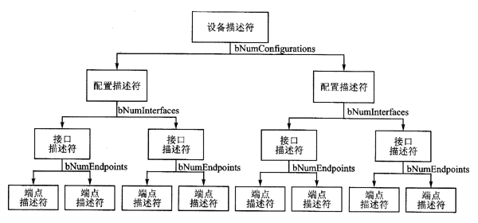

# 代码导读

## 前提

我们在这里假设读者已经掌握了以下概念:

## 目的&前言

我们的最终目的是形成一个跨平台的、操作系统无关的、no_std环境下的usb host(xhci)库，本章节的目的在于通过引领读者阅读一遍已完成的小目标的代码来让读者熟悉目前的项目进展与框架。

在本章节中，我们将会结合目前已有的代码来学习如何从0开始编写一个主机端的USB鼠标驱动。

## 开始

我们的主机端驱动基于XHCI控制器，因此我们先从XHCI开始.

### 首先是控制器的启用与初始化，遵循[xhci文档](./assert/extensible-host-controler-interface-usb-xhci.pdf)第四章(Operation Model)的描述，我们进行如下操作

* [代码地址（见调用此方法处）](https://github.com/arceos-usb/arceos_experiment/blob/phytium_pi_dev/crates/driver_usb/src/host/xhci/mod.rs#L80)

```rust
//...
impl<O> Xhci<O>
where
    O: OsDep,
{
    fn init(&mut self) -> Result {
        self.chip_hardware_reset()?;    //重置控制器
        self.set_max_device_slots()?;   //配置设备槽位
        self.set_dcbaap()?;             //设置device context数组基地址
        self.set_cmd_ring()?;           //配置命令环
        self.init_ir()?;                //配置中断寄存器组

        self.setup_scratchpads();       //配置xhci控制器所使用的内存
        self.start()?;                  //启动控制器

        self.test_cmd()?;               //验证命令环
        self.reset_ports();             //重置端口
        Ok(())
    }
//...
```

### 在控制器初始化完成后，就开始枚举USB设备并分配驱动，目前我们这一块的代码比较简陋

* [开始枚举](https://github.com/arceos-usb/arceos_experiment/blob/phytium_pi_dev/apps/usb/src/main.rs#L49)

* [poll函数的调用处](https://github.com/arceos-usb/arceos_experiment/blob/phytium_pi_dev/crates/driver_usb/src/host/mod.rs#L109)

* [poll函数的实现](https://github.com/arceos-usb/arceos_experiment/blob/phytium_pi_dev/crates/driver_usb/src/host/xhci/mod.rs#L127)

```rust
//...
    fn poll( //此函数同样的，遵循xhci文档第四章的部分
        &mut self,
        arc: Arc<SpinNoIrq<Box<dyn Controller<O>>>>,
    ) -> Result<Vec<DeviceAttached<O>>> {
        let mut port_id_list = Vec::new();
        let port_len = self.regs().port_register_set.len();
        for i in 0..port_len { //确保每一个port都已经被正确的初始化，并且将连接上设备的port记录下来(由于多线程在飞腾派上不完善，我们目前没有热拔插功能)
            let portsc = &self.regs_mut().port_register_set.read_volatile_at(i).portsc;
            info!(
                "{TAG} Port {}: Enabled: {}, Connected: {}, Speed {}, Power {}",
                i,
                portsc.port_enabled_disabled(),
                portsc.current_connect_status(),
                portsc.port_speed(),
                portsc.port_power()
            );

            if !portsc.port_enabled_disabled() {
                continue;
            }

            port_id_list.push(i);
        }
        let mut device_list = Vec::new();
        for port_idx in port_id_list { //为每一个设备初始化
            let port_id = port_idx + 1;
            let slot = self.device_slot_assignment()?;  //向控制器请求分配一个slot号，作为设备的标识符
            let mut device = self.dev_ctx.new_slot(     //将设备与slot绑定
                slot as usize,
                0,
                port_id,
                32,
                self.config.os.clone(),
                arc.clone(),
            )?;
            debug!("assign complete!");
            self.address_device(&device)?;              //向控制器通告设备与slot之间的绑定关系

            self.print_context(&device);

//-----------------------------------------从这里开始进入USB的部分-----------------------------------------//
            let packet_size0 = self.fetch_package_size0(&device)?; //获取*端点0*的包传输大小 --之后会讲

            debug!("packet_size0: {}", packet_size0);

            self.set_ep0_packet_size(&device, packet_size0); //正确配置端点0的传输包大小
            let desc = self.fetch_device_desc(&device)?;//获取设备的描述符
            let vid = desc.vendor; //生产厂家id
            let pid = desc.product_id;//产品id

            // debug!("current state:");
            // self.debug_dump_output_ctx(slot.into());

            info!("device found, pid: {pid:#X}, vid: {vid:#X}");

            device.device_desc = desc;

            trace!(
                "fetching device configurations, num:{}",
                device.device_desc.num_configurations
            );
            for i in 0..device.device_desc.num_configurations {//对于一个usb设备，其内置了厂家定义的数个可选的工作模式/配置(config),在这里，我们获取所有的配置
                let config = self.fetch_config_desc(&device, i)?;//发送控制传输请求：获取配置描述符
                trace!("{:#?}", config);
                device.configs.push(config)
            }

            //TODO: set interface 1?

            // device.set_current_interface(1); //just change this line to switch interface //interface：当设备是一个复合设备的时候，就通过interface来定义不同的功能与其对应的端点。在代码测试所用的无线鼠标上，不需要手动设置interface，因为其默认interface就是鼠标，但是视情况不同，可能需要手动配置

            self.set_configuration(&device, 0)?; //进入设备的初始化阶段

            device_list.push(device);
        }
        Ok(device_list)
    }
//...
```

在以上代码中，我们提到了以下概念：

* 端点：[又称为通道](https://www.usbzh.com/article/detail-445.html)，是传输数据的抽象载体，端点一共有3+1种类型：
    1. 中断端点(Interrupt Endpoint)：此类端点对应于[中断传输](https://www.usbzh.com/article/detail-109.html)用于传输数据量不大，但是要求实时性的数据，如HID设备(Human Interface Device，人类交互设备，如鼠标/键盘/手柄等)的回报报文。
    2. 同步端点(Isochronous)：此类端点对应于[同步传输](https://www.usbzh.com/article/detail-118.html)用于数据连续、实时且大量的数据传输,如：摄像头。
    3. 块端点(Bulk Endpoint)：此类端点对应于[块传输](https://www.usbzh.com/article/detail-40.html)，用于数据量大但对实时性要求不高的场合，也就是传文件。
    4. 控制端点(Control Endpoint/Endpoint 0)：在[USB协议文档](./assert/[USB3.2协议规范]USB%203.2%20Revision%201.1.pdf)中，明确的定义了0号端点为控制端点，这个端点永远处于可用状态，其对应的[控制传输](https://www.usbzh.com/article/detail-55.html)负责控制/获取USB设备的状态
  * USB设备初始状态下只有一个0号端点-即控制端点是固定的，其余的端点都处于未配置状态-此时端点的类型是没有配置的
  * 对于具体的哪个端点是什么类型，这些信息都被存储在[Interface描述符](https://www.usbzh.com/article/detail-64.html)下属的[端点描述符](https://www.usbzh.com/article/detail-56.html)中
    * Q:什么叫"下属的描述符?"
    * A:描述符是嵌套结构，举个例子，最简单的如下：

        

        具体的来说，[资料可以看这里](https://www.usbzh.com/article/detail-22.html)

        在我们的代码中，这些描述符都被编写为结构体，[在这里](https://github.com/arceos-usb/arceos_experiment/tree/phytium_pi_dev/crates/driver_usb/src/host/usb/descriptors)
* Slot号：简而言之，为了方便起见，设备在内存中的抽象应当与物理上的结构无关，因此我们会为每个设备分配一个Slot Id来区别他们。
* 传输包大小：即端点单次传输所能返回的数据量，这一部分的实现细节在硬件层，我们只需要配置这个字段即可。
* 多线程不完善：谁来把这个问题修一下？主要问题在于中断系统没修好，导致无法定时中断进行调度。

### 系统架构

我们所预期的，在逻辑上的系统结构如下:


