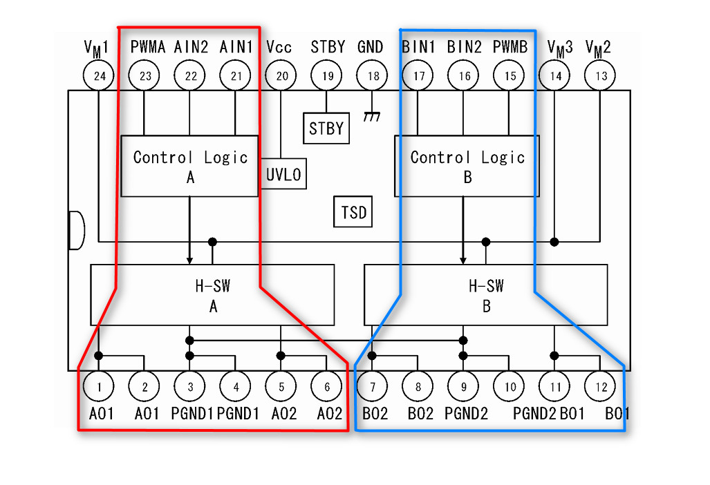

# TB6612FNG芯片的使用

- ## `TB6612FNG`原理图

    这里只介绍一些和开发代码有关的引脚使用，关于电路怎么设计，及其他引脚有什么含义这里不需要考虑。这里放一张`TB6612FNG`的原理图。  

    

    `TB6612FNG`是用来驱动电机的，一个芯片能驱动两个电机，红色蓝色部分表示各自相关的引脚。这里只对红色区域的A组进行介绍，蓝色的B组与之同理。  
    
- ## 使用方法

    驱动一路电机需要三个引脚，就是上面一排红色区域的`PWMA`、`AIN2`、`AIN1`这是一组，负责驱动下面的`A01`和`A02`，这两个引脚是连接电机的。`PGND`应该是预留的电机接地引脚，这里用不到，有两个`A01`和`A02`是为了应对大电流电机的驱动。`PWMA`引脚比较简单，就是通过`PWM`来控制电机的速度的，而`A01`和`A02`是通过高低电平的不同来控制电机的启停和正反转，具体参见下表，这个表来自芯片的数据手册，对原表进行了简化。  

    <table  align="center" style="text-align:center" border="1">
        <tr>
            <th colspan="2" style="text-align:center">INPUT</th>
            <th colspan="3" style="text-align:center">OUTPUT</th>
        </tr>
        <tr>
            <th>AIN1</th>
            <th>AIN2</th>
            <th>A01</th>
            <th>A02</th>
            <th style="text-align:center">效果</th>
        </tr>
        <tr>
            <td>高</td>
            <td>高</td>
            <td>低</td>
            <td>低</td>
            <td>刹车</td>
        </tr>
        <tr>
            <td>低</td>
            <td>高</td>
            <td>低</td>
            <td>高</td>
            <td>运动</td>
        </tr>
        <tr>
            <td>高</td>
            <td>低</td>
            <td>高</td>
            <td>低</td>
            <td>反向运动</td>
        </tr>
        <tr>
            <td>低</td>
            <td>低</td>
            <td>OFF</td>
            <td>OFF</td>
            <td>断电滑行</td>
        </tr>
    </table>

    其中运动与反向运动比较好理解，就是电机正反转。刹车指的是电机依然通电，但是无法转动，可以理解为正在运动的电机立马锁死；与之对应的就是断电滑行，就是电机不通电，如果正在运动，则会根据惯性向前滑行。

    所以对于电机的控制就只需要两个`IO`引脚输出高低电平，以及一个PWM引脚，但是四个电机就需要12个引脚，飞腾派上没有引出这么多，因此就需要下面的芯片了。  