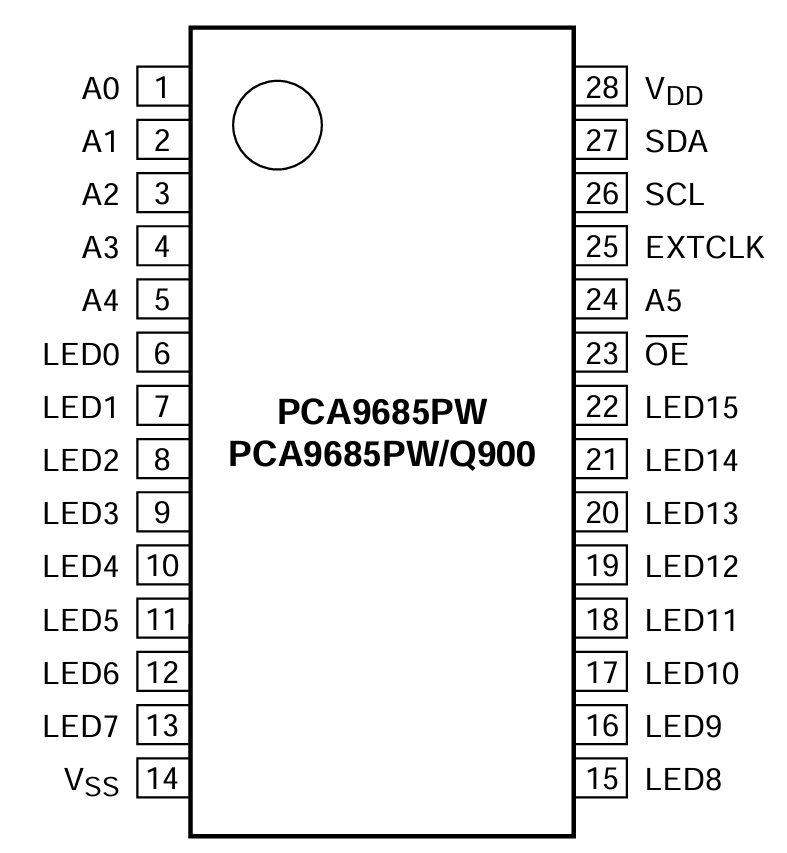
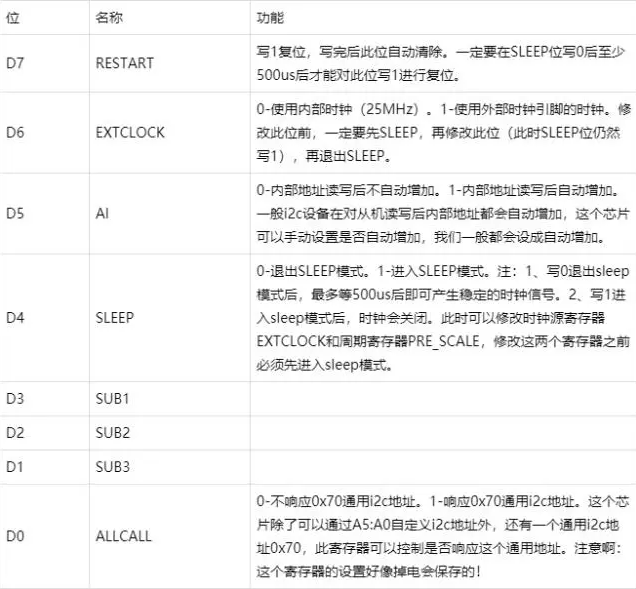
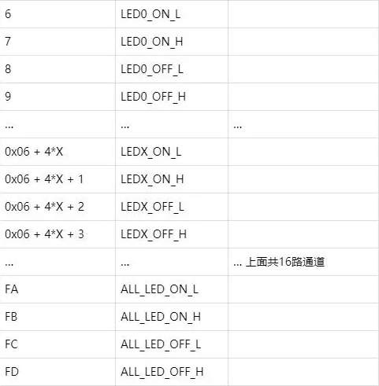
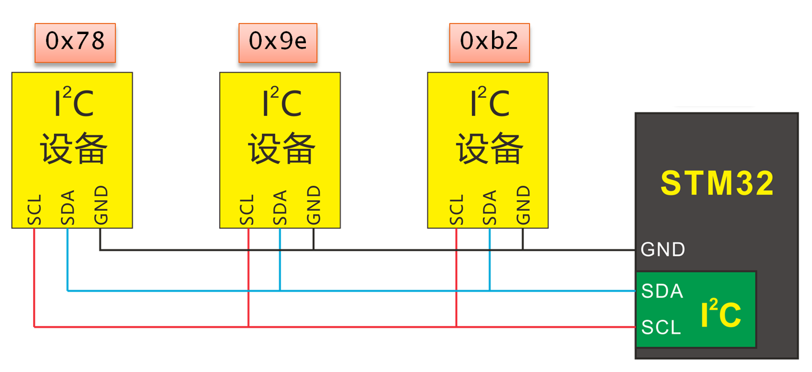

# PCA9685芯片的使用

- ## `PCA9685`芯片介绍

    这个芯片是通过`I2C`接口控制16路`PWM`输出，因此就相当于引脚扩展。但如果只是`PWM`扩展的话，那就只能实现输出`PWM`方波，即高低电平一直转换，无法实现`IO`的单输出低电平或者高电平，但是根据这个芯片的特性，也是可以实现和`IO`一样的功能的。下面先介绍一下这个芯片的使用。  
    
      

    可以看到使用的是`I2C`的通信引脚，即`SDA`和`SCL`，另外`A0~A5`是六位地址引脚，用于控制芯片在`I2C`总线上的地址，这里用不到就不做过多介绍了。`LED0~LED15`就是扩展的16位引脚了。  

    关于I2C在下一节进行介绍，关于PCA9685的使用可以先理解为就是通过对芯片内寄存器的读写来实现对芯片的控制的，寄存器存在多个，因此读写操作时需要寄存器的地址。下面介绍一下芯片中寄存器的作用。

    - ### MODE1寄存器 地址0x00
    
        这个寄存器的作用是对芯片做一些配置用的，这8位各有作用，先放一张图可以参考一下，这里只介绍用到的几位。  

        

        这里常用的位是D4、D7，其他位保持默认就好，一般也都是0。D4是在修改时钟相关寄存器时候，需要先写1关闭时钟信号输出，然后等写好时钟相关寄存器之后，再对D4写0开启时钟信号，但是写0之后需要再对D7写1进行复位，D7写1复位后会自动把这位清除成0，因此不用写0。  

        因此，如果除了D4和D7之外，其他位都是0的话，那么修改一次时钟相关寄存器的操作是这样的：
        ```cmd
        寄存器：0x00，数据：0x10
        修改时钟寄存器
        寄存器：0x00，数据：0x00
        等待500us
        寄存器：0x00，数据：0x80
        ```
    
    - ### PRE_SCALE寄存器 地址0xFE

        这个寄存器是用来修改芯片产生的PWM周期的。下面是这个寄存器中值的计算公式：

        ## $prescale\underline{\quad}value=round(\frac{osc\underline{\quad}clock}{4096 * Frequency})-1$

        - `prescale_value` 就是要写入寄存器的结果
        - `round` 表示取整，即结果要求证书，向上取整还是向下取整，亦或是四舍五入都可以
        - `osc_clock` 表示芯片的时钟频率，刚才根据MODE1中的D6位可以看出，我们使用内部时钟的话频率是25MHz，所以这个值为25000000
        - `4096` 这个常数跟PWM的占空比控制有关，一个PWM周期是被分为了4096份，这个是不可修改的，因此是个常数
        - `Frequency` 表示要修改的PWM周期的频率，例如使用常用的多级的话一个周期是20ms，那这里就是50Hz
        - `-1` 这就是固定操作了，数据手册中给的要求

        我们以控制`MG996R`或者`SG90`这种常用的180度舵机为例子，这种舵机需要`PWM`周期为`20ms`，所以`PWM`频率为`50Hz`，取证使用向下取整，即`C`语言对整数除法的取整方式，这里可以计算得到结果`prescale_value=25000000/4096/50-1=121`  

        但是在网上查阅了一下，很多实际使用的时候这个计算出来的周期和实际的周期存在一点误差，因此对这个公式有一个误差修正，具体如下：
        
        ## $prescale\underline{\quad}value=round(\frac{osc\underline{\quad}clock}{4096 * (Frequency * 0.98)})-1$

        可以看到是对频率乘上了0.98，这个数字是多次测试测出来的一个经验值，修改后再计算刚才舵机的prescale_value可以得到`prescale_value=25000000/4096/50/0.98-1=123`  

        计算得到prescale_value的值后，把这个值写入PRE_SCALE寄存器即可，需要结合MODE1寄存器的D4和D7位进行操作。

    - ### LEDx引脚控制相关寄存器

        一共有16路PWM引脚，在引脚定义上是LED0~LED15，每一路控制方法一样，下面就以LED0为例进行介绍。下面先放一张每个引脚控制对应的寄存器地址图。  

        

        可以看到LED0使用了四个寄存器，地址从0x06到0x09。先介绍一下PCA9685控制PWM占空比的原理，对每个引脚可以在芯片中设置PWM高电平的起始和结束位置，之前介绍PRE_SCALE寄存器时候说过，芯片中对一个PWM周期是会分成4096份的，因此这个起始结束位置也是以这个4096份进行设置的，设置的范围就是0~4095，因为最大可以是4095，所以一个开始或者结束需要两字节存储，那一个引脚的开始加结束就需要四字节，所以这里才有四个寄存器，那么对这四个寄存器的使用应该也有了解了，具体的寄存器含义以LED0为例，如下所示：  

        ```cmd
        LED0_ON_L   地址：0x06  起始位置低8位
        LED0_ON_H   地址：0x07  起始位置高8位
        LED0_OFF_L  地址：0x08  结束位置低8位
        LED0_OFF_H  地址：0x09  结束位置高8位
        ```

        下面还以`MG996R`或者`SG90`舵机为例子，假如需要舵机旋转角度为90度，那么对应的高电平需要的时间是1.5ms，因为PWM周期是20ms，所以可以得到高电平时间在整个PWM周期中所占比例为$1.5/20$，这里20ms就是对应4096份，因此高电平时间对应的份数应该是$4096*(1.5/20)=307.2$，可以取整得到307，那么可以让起始位置在0处，结束位置在307，所以寄存器的设置如下：
        
        ```cmd
        LED0_ON_L   地址：0x06  数据：0x00
        LED0_ON_H   地址：0x07  数据：0x00
        LED0_OFF_L  地址：0x08  数据：0x33
        LED0_OFF_H  地址：0x09  数据：0x01
        ```

        其实在实际使用时候起始位置都可以设置成0x00，只需要计算高电平所占份数，得到的结果就可以设置成结束位置，这里LED0_OFF_L的数据0x33就是对307取低八位得到的，LED0_OFF_H的0x01同理是307的高八位。  

        剩下的15个引脚控制方法相同，寄存器地址就是在LED0的四个地址上增加。还有四个特殊的寄存器，是控制所有的16个引脚，就是0xFA~0xFD，控制方法和控制一个引脚相同，设置完这四个寄存器后，16路PWM输出会变成一样的。

- ## `I2C`使用

    在飞腾派使用以及飞腾小车的开发过程中我们不需要编写`I2C`驱动，因此这里不对I2C的时序、发送的数据格式等等做介绍，这里简单介绍一下`I2C`协议以及如何在`Linux`下和`Python`中使用。  
    - ### `I2C`介绍

        没有了解过硬件相关知识的人可以这么理解`I2C`，就是所有数据都是根据寄存器地址进行读写的，另外`I2C`是一个总线协议，因此所有芯片都是连在相同的两根线上，即是共用的；所以每次读的时候，就是给`I2C`总线发送要读设备地址和寄存器地址；同理，写的时候，就是发送要写的设备地址、寄存器地址和要写的数据。  

        在同一个`I2C`总线上的芯片都会接收到每次发送的请求，芯片会进行设备地址校验，如果不是自己的设备地址，那就不会响应这次请求。  

          
    - ### 在`Linux`下使用`I2C`

        在`Linux`下使用`I2C`有一个工具`i2c-tools`，飞腾派官方镜像中是自带这个的，如果没有的话可以在终端运行下面命令安装一下。  
        ```cmd
        sudo apt-get install i2c-tools
        ```
        这个工具里包含很多命令，下面一个一个来说。

        - ### `i2cdetect`扫描I2C总线并列出已连接的设备

            首先在一个开发板或者`PC`上是可能有多个`I2C`总线的，因此可以先列出所有的`I2C`总线。    
            ```cmd
            i2cdetect -l
            ```
            返回的内容格式如下：
            ```cmd
            i2c-3   i2c         56247000.i2c            I2C adapter
            i2c-2   i2c         56226000.i2c            I2C adapter
            ```
            其中`i2c-2`和`i2c-3`就表示可以用的总线号为`2`和`3`。  

            知道可用的总线后，便可以使用如下命令查看一个总线上的所有设备。  
            ```cmd
            i2cdetect -r -y 2
            ```
            返回的内容格式如下：
            ```cmd
                 0  1  2  3  4  5  6  7  8  9  a  b  c  d  e  f
            00:          -- -- -- -- -- -- -- -- -- -- -- -- -- 
            10: -- -- -- -- -- -- -- -- -- -- -- -- -- -- -- -- 
            20: -- -- -- -- -- -- -- -- -- -- UU -- -- -- -- -- 
            30: -- -- -- -- -- -- -- -- -- -- -- -- -- -- -- -- 
            40: -- -- -- -- -- -- -- -- -- -- -- -- -- -- -- -- 
            50: -- -- -- -- -- -- -- -- -- -- -- -- -- -- -- -- 
            60: UU -- -- -- -- -- -- -- -- -- -- -- -- -- -- -- 
            70: -- -- -- -- -- -- -- --
            ```
            以上面这个返回为例子，可以看到在总线`2`上有两个设备，地址分别为`0x2a`和`0x60`，在不为`--`的位置上把行和列加起来就是设备的地址，有时候会显示`UU`，有时候也会直接显示设备地址。   

        - ### `i2cdump`显示`I2C`设备的所有寄存器内容

            知道可用总线及设备后，接下来可以对设备进行读写了，先说一下读取，有两种方式，一种是直接读取设备所有寄存器数据，就是这个`i2cdump`指令，另一个是`i2cget`，只读取一个寄存器，这个下面再讲。`i2cdump`的使用举例如下：  
            ```cmd
            i2cdump -f -y 2 0x2a
            ```
            这里就是指定了要读取的总线及设备的地址，返回的结果格式如下：  
            ```cmd
            No size specified (using byte-data access)
                0  1  2  3  4  5  6  7  8  9  a  b  c  d  e  f    0123456789abcdef
            00: da 00 81 00 fb 03 00 00 00 00 00 43 01 03 00 00   ?.?.??.....C??..
            10: 55 55 55 00 00 00 00 00 00 00 00 00 00 00 00 00   UUU.............
            20: 00 00 00 00 00 00 00 00 00 00 00 00 00 00 00 00   ................
            30: 00 00 00 00 00 00 00 00 00 00 00 00 00 00 00 00   ................
            40: 00 00 00 00 00 00 00 00 00 00 00 00 00 00 00 00   ................
            50: 00 00 00 00 00 00 00 00 00 00 00 00 00 00 00 00   ................
            60: 00 00 00 00 00 00 00 00 00 00 00 00 00 00 00 00   ................
            70: 00 00 00 00 00 00 00 00 00 00 00 00 00 00 00 00   ................
            80: 00 00 00 00 00 00 00 00 00 00 00 00 00 00 00 00   ................
            90: 00 00 00 00 00 00 00 00 00 00 00 00 00 00 00 00   ................
            a0: 00 00 00 00 00 00 00 00 00 00 00 00 00 00 00 00   ................
            b0: 00 00 00 00 00 00 00 00 00 00 00 00 00 00 00 00   ................
            c0: 00 00 00 00 00 00 00 00 00 00 00 00 00 00 00 00   ................
            d0: 00 00 00 00 00 00 00 00 00 00 00 00 00 00 00 00   ................
            e0: 00 00 00 00 00 00 00 00 00 00 00 00 00 00 00 00   ................
            f0: 00 00 00 00 00 00 00 00 00 00 00 00 00 00 00 00   ................
            ```
            就是一个类似表格的形式，展示设备中所有寄存器的数据，右边是一个转`ASCII`字符的展示。这个指令可以方便的查看设备寄存器数据，调试时候比较好用。
        - ### `i2cget`从指定寄存器中读取数据

            下面介绍读取指定寄存器数据的指令。`i2cget`一次可以读出来一个寄存器的数据，使用举例如下：  
            ```cmd
            sudo i2cget -y 2 0x2a 0x02
            ```
            这里就是读取总线`2`上的设备地址为`0x2a`的芯片上寄存器地址为`0x02`中的数据。返回内容就是十六进制的一个字节的数据。
            ```cmd
            0x81
            ```
        - ### `i2cset`向指定`I2C`设备的寄存器中写入数据

            下面介绍向寄存器中写入数据，`i2cset`指令一次只能写入一个寄存器数据，使用距离如下：  
            ```cmd
            i2cset -f -y 2 0x2a 0x77 0x3f
            ```
            这里就是向总线`2`上设备地址为`0x2a`的芯片上寄存器地址为`0x77`中写入数据`0x3f`，这个指令正确执行时候没有返回。如果想验证是否写入成功可以读取寄存器数据进行查看。
    - ### 在`Python`下使用`I2C`

        需要安装第三方库smbus，使用pip管理Pyhon库的话，使用如下命令安装。
        ```cmd
        pip3 install smbus
        ```
        如果是使用apt管理Python的库的话，使用如下命令安装smbus。
        ```cmd
        sudo apt-get update
        sudo apt-get install python3-smbus
        ```
        有时候apt可能找不到需要的包，因此需要先update更新一下。  