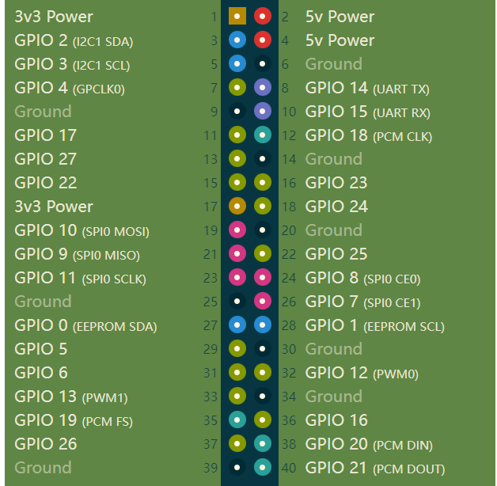
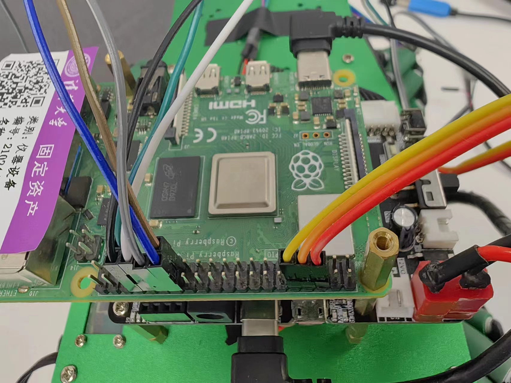

# 实验四：树莓派启动 ArceOS,打印Hello,world

## 前置知识

### SD卡的配置：
   * 创建一个名为`boot`的`FAT32`分区
   * 在SD卡上生成一个名为`config.txt`的文件，并将以下内容写入其中：

    ```
    arm_64bit=1
    init_uart_clock=48000000
    ```
   * 从[Raspberry Pi firmware repo](https://github.com/raspberrypi/firmware/tree/master/boot)中将以下文件复制到SD卡上：
     - [fixup4.dat](https://github.com/raspberrypi/firmware/raw/master/boot/fixup4.dat)
     - [start4.elf](https://github.com/raspberrypi/firmware/raw/master/boot/start4.elf)
     - [bcm2711-rpi-4-b.dtb](https://github.com/raspberrypi/firmware/raw/master/boot/bcm2711-rpi-4-b.dtb)
     - ~~[bootcode.bin](https://github.com/raspberrypi/firmware/raw/master/boot/bootcode.bin)~~ （树莓派3需要，4不需要）
   
   * 将通过编译生成的`kernel8.img`复制到SD卡上
       kernel8.img的生成
       * 首先，克隆这个仓库：

        ```shell
        git clone https://github.com/chenlongos/rust-raspberrypi-OS-tutorials.git
        ```

        * 然后，在06_uart_chainloader目录下，执行：

        ```
        BSP=rpi4 make
        ```

        便可以看到生成了一个kernel8.img文件。
   
### 树莓派上电启动启动流程：
   * 硬件初始化： 树莓派4上电后，硬件会被初始化，包括CPU、内存、外设等。
   * GPU加载启动代码（bootcode.bin）： GPU（图形处理单元）是树莓派启动的主要控制器。在启动时，GPU会从SD卡的boot分区加载一个文件，通常是 bootcode.bin。这个文件包含了GPU的启动代码，负责初始化系统硬件，设置内存分配和加载下一阶段的启动代码。
   * 加载启动配置文件（config.txt）： GPU加载 config.txt 文件，该文件包含了系统的配置信息，比如时钟频率、内存分配等。
   * 加载启动文件（start4.elf）： GPU加载 start4.elf 文件，它是一个二进制文件，包含了树莓派系统的启动代码，它负责初始化硬件和启动ARM处理器。
   * 加载设备树文件（bcm2711-rpi-4-b.dtb）：start4.elf文件应该也会去读取设备树文件，然后设置一些基本的参数。
   * 加载操作系统内核（kernel8.img）： start4.elf 文件会加载操作系统内核，是一个名为 kernel8.img 的文件。这个内核文件是一个裸机可执行文件，包含了操作系统的核心功能。
   * 初始化和启动操作系统： 内核文件被加载到内存后，GPU将控制权交给ARM处理器，操作系统开始初始化并启动，完成系统的启动过程。

### 树莓派通过串口与主机连接

将三根串口连接线分别了解到编号为6,8,10的三个引脚处。（6号对应的是地线GND，8号对应的是TXD，10号对应的是RXD）





再将一根USB串口转换线与连接到树莓派的线相连，其中TXD对应RXD，RXD对应TXD，GND对应GND。（默认情况下，USB串口转换线中黑色代表GND，白色代表RXD，绿色代表TXD，红色不连接）

### 连接软件的使用

以putty为例：

连接类型选择Serial，再将Serial line改为COM3（具体需要自己查看）,Speed(波特率)设为115200，最后点击Open即可。


   
## 实验内容

1. 在ArceOS目录下，输入：

   ```shell
   make A=apps/helloworld ARCH=aarch64 PLATFORM=aarch64-raspi4  LOG=debug 
   ```

   编译出ArceOS在raspi4 上的一个镜像。

2. 编译生成一个kernel8.img文件：

   ```shell
   BSP=rpi4 make
   ```

3. 把 kernel8.img 和 helloworld_aarch64-raspi4.bin 通过 cat 命令拼接到一个 bin 文件中，仍然取名为 kernel8.img

   ```
   cat ../rust-raspberrypi-OS-tutorials/06_uart_chainloader/kernel8.img apps/helloworld/helloworld_aarch64-raspi4.bin > kernel8.img
   ```
   
若已有树莓派开发板则进行以下操作：

4. 把新生成的 kernel8.img 拷贝到 sd 卡上。

5. 将树莓派与PC相连，打开连接软件。

6. 启动树莓派板子，可以看到上电后输出 miniload 并进入到 arceos helloworld 里

   ```shell

          d8888                            .d88888b.   .d8888b.
         d88888                           d88P" "Y88b d88P  Y88b
        d88P888                           888     888 Y88b.
       d88P 888 888d888  .d8888b  .d88b.  888     888  "Y888b.
      d88P  888 888P"   d88P"    d8P  Y8b 888     888     "Y88b.
     d88P   888 888     888      88888888 888     888       "888
    d8888888888 888     Y88b.    Y8b.     Y88b. .d88P Y88b  d88P
   d88P     888 888      "Y8888P  "Y8888   "Y88888P"   "Y8888P"

   arch = aarch64
   platform = aarch64-raspi4
   target = aarch64-unknown-none-softfloat
   smp = 1
   build_mode = release
   log_level = debug
   
   [  0.108847 0 axruntime:126] Logging is enabled.
   [  0.114576 0 axruntime:127] Primary CPU 0 started, dtb = 0x0.
   [  0.121522 0 axruntime:129] Found physcial memory regions:
   [  0.128209 0 axruntime:131]   [PA:0x80000, PA:0x86000) .text (READ | EXECUTE | RESERVED)
   [  0.137498 0 axruntime:131]   [PA:0x86000, PA:0x88000) .rodata (READ | RESERVED)
   [  0.146093 0 axruntime:131]   [PA:0x88000, PA:0x8c000) .data .tdata .tbss .percpu (READ | WRITE | RESERVED)
   [  0.157033 0 axruntime:131]   [PA:0x8c000, PA:0xcc000) boot stack (READ | WRITE | RESERVED)
   [  0.166583 0 axruntime:131]   [PA:0xcc000, PA:0xcd000) .bss (READ | WRITE | RESERVED)
   [  0.175613 0 axruntime:131]   [PA:0x0, PA:0x1000) spintable (READ | WRITE | RESERVED)
   [  0.184642 0 axruntime:131]   [PA:0xcd000, PA:0xfc000000) free memory (READ | WRITE | FREE)
   [  0.194193 0 axruntime:131]   [PA:0xfe201000, PA:0xfe202000) mmio (READ | WRITE | DEVICE | RESERVED)
   [  0.204525 0 axruntime:131]   [PA:0xff841000, PA:0xff849000) mmio (READ | WRITE | DEVICE | RESERVED)
   [  0.214857 0 axruntime:149] Initialize platform devices...
   [  0.221542 0 axruntime:185] Primary CPU 0 init OK.
   Hello, world! 
   [  9.556116 0 axruntime:198] main task exited: exit_code=0
   [  9.560792 0 axhal::platform::aarch64_raspi::misc:21] Shutting down...
   ```

若没有开发板则在qemu模拟器中进行：

4. 在qemu中运行kernel8.img:

   ```shell
   ./qemu-system-aarch64 -m 2G -smp 4 -cpu cortex-a72 -machine raspi4b2g -nographic -kernel arceos/kernel8.img
   ```

5. 可以看到输出：
   ```shell
   
          d8888                            .d88888b.   .d8888b.
         d88888                           d88P" "Y88b d88P  Y88b
        d88P888                           888     888 Y88b.
       d88P 888 888d888  .d8888b  .d88b.  888     888  "Y888b.
      d88P  888 888P"   d88P"    d8P  Y8b 888     888     "Y88b.
     d88P   888 888     888      88888888 888     888       "888
    d8888888888 888     Y88b.    Y8b.     Y88b. .d88P Y88b  d88P
   d88P     888 888      "Y8888P  "Y8888   "Y88888P"   "Y8888P"

   arch = aarch64
   platform = aarch64-raspi4
   target = aarch64-unknown-none-softfloat
   smp = 1
   build_mode = release
   log_level = debug 
   
   [  0.018980 0 axruntime:126] Logging is enabled.
   [  0.021262 0 axruntime:127] Primary CPU 0 started, dtb = 0x0.
   [  0.022619 0 axruntime:129] Found physcial memory regions:
   [  0.023704 0 axruntime:131]   [PA:0x80000, PA:0x86000) .text (READ | EXECUTE | RESERVED)
   [  0.025339 0 axruntime:131]   [PA:0x86000, PA:0x88000) .rodata (READ | RESERVED)
   [  0.026509 0 axruntime:131]   [PA:0x88000, PA:0x8c000) .data .tdata .tbss .percpu (READ | WRITE | RESERVED)
   [  0.028264 0 axruntime:131]   [PA:0x8c000, PA:0xcc000) boot stack (READ | WRITE | RESERVED)
   [  0.029420 0 axruntime:131]   [PA:0xcc000, PA:0xcd000) .bss (READ | WRITE | RESERVED)
   [  0.030306 0 axruntime:131]   [PA:0x0, PA:0x1000) spintable (READ | WRITE | RESERVED)
   [  0.032056 0 axruntime:131]   [PA:0xcd000, PA:0xfc000000) free memory (READ | WRITE | FREE)
   [  0.032680 0 axruntime:131]   [PA:0xfe201000, PA:0xfe202000) mmio (READ | WRITE | DEVICE | RESERVED)
   [  0.033333 0 axruntime:131]   [PA:0xff841000, PA:0xff849000) mmio (READ | WRITE | DEVICE | RESERVED)
   [  0.034284 0 axruntime:149] Initialize platform devices...
   [  0.035041 0 axruntime:185] Primary CPU 0 init OK.
   Hello, world!
   [  0.036391 0 axruntime:198] main task exited: exit_code=0
   [  0.037152 0 axhal::platform::aarch64_raspi::misc:21] Shutting down...
   ```

   （ArceOS上面的内容miniload是原先的kernel8.img里的）
   

至此，实验四结束，最终提交实验过程记录（包含出现的各类问题及解决办法）以及ArceOS成功运行，打印Hello，world的结果。


